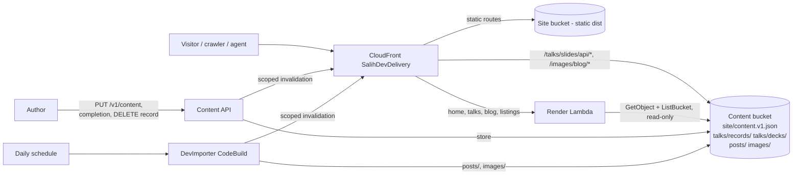

# Design Document: Backend-Served Content

## Overview

This feature moves every page whose content lives in the content bucket from the baked static build to request-time rendering, so a content change is live in seconds without a publisher build. The dynamic surface is the home page (Location, Events, latest posts), the Talks archive, the blog index, every post, the category and tag pages, each with its Markdown alternate, and the machine-readable listings `rss.xml`, `sitemap.xml`, `llms.txt` and `llms-full.txt`. It adds one read-only Render Lambda as a second CloudFront origin on the existing `SalihDevDelivery` distribution, behind cache behaviors that route only the dynamic routes to it. Slide decks and blog images are served straight from the content bucket through two prefix-scoped origins, so the Render Lambda never downloads a PDF. About, Contact, the 404 page, the skills pages and the API catalog stay static and publish only through the CodeBuild publisher, which is now for code and design changes. The daily DEV import writes posts to the content bucket and invalidates the blog routes without a site build.

The design's load-bearing property is byte-parity with the static build. The Talks HTML, its JSON-LD, and its Markdown alternate are already produced by pure, side-effect-free modules (`src/lib/talks/gateway.ts` pure helpers, `projection.ts`, `markdown.ts`) from one validated published snapshot; the Location and Events display is produced by pure classification (`src/config/site-content.ts`, `src/config/site.ts`, `LocationSidebar.astro`'s markup) from one validated content object. Posts go through one blog schema (`src/lib/blog/schema.ts`) and one Markdown configuration (`src/lib/markdown-config.ts`) shared by the Astro collection and the S3 post source. The Render Lambda reuses those exact modules and the same `.astro` pages, reading the same S3 objects the publisher and the importer write, so what it emits at request time matches what the static build would have baked.

### Goals

- Serve the home page, `/talks/`, the blog index, posts, categories, tags, their Markdown alternates, and the four machine-readable listings at request time from the content bucket.
- Serve `/talks/slides/api/<deckId>.pdf` and `/images/blog/*` straight from the content bucket through CloudFront.
- Make `PUT /v1/content`, talk-upload completion, talk removal, and the daily DEV import go live in seconds by invalidating exactly the affected dynamic routes instead of starting the publisher.
- Keep the request-time output identical to the static build: same HTML, JSON-LD, Markdown, headers, ordering, date formatting, empty state, and draft exclusion.
- Keep the Render Lambda strictly read-only and least-privilege, reachable only through CloudFront.
- Keep the static build and its verification green without materializing dynamic content.

### Non-goals

- Making every page dynamic. About, Contact, the 404 page, the skills pages, the API catalog and the assets stay static.
- A new datastore, admin surface, authentication, or visitor-facing write path.
- Changing the publisher's role for code and design changes.
- Client-side fetching of primary content; the server response carries the full HTML, Markdown, and structured data.
- Any AWS mutation or deployment in this change.

### Repository and research findings

- `astro.config.ts` sets `output: "static"`; the site is synced to the private OAC S3 origin and served by one CloudFront distribution in `infra/lib/delivery-stack.ts`. The distribution already carries a viewer-request CloudFront Function (`edge-functions.ts`) that maps clean URLs to S3 keys and negotiates Markdown, and a viewer-response function that advertises representations.
- Talk rendering is centralized: `gateway.ts` is the only reader of the `talks` collection, and `projection.ts`/`markdown.ts` are pure. `getPublishedTalksSnapshot()` returns the newest-first, draft-excluded snapshot. The `/talks/` page, `/talks/index.md`, `sitemap.xml`, `llms.txt`, and `llms-full.txt` all consume that one snapshot.
- The `talks` collection is populated by `npm run materialize:talks` (`scripts/materialize-api-talks.mjs` → `src/lib/talks/materialize.ts`), which reads the publisher's local caches of `talks/records/` and `talks/decks/`. The record shape (`api-record.ts`) and the deck path derivation (`deck.ts`) are pure and reusable outside Astro.
- Location and events: `site-content.ts` reads `site-content.default.json` (or `SITE_CONTENT_PATH`), validates through `site-content-schema.ts`, and classifies events into `upcoming`/`recent`. `site.ts` exposes `location` and `conferences`. These render in `LocationSidebar.astro` (home `/`), `BaseLayout.astro` JSON-LD `homeLocation` (every page head), and the home Markdown document in `markdown-documents.ts`.
- The three write handlers (`content-write.ts`, `talk-upload-complete.ts`, `talk-records.ts`) each end by calling `codebuild:StartBuild`. Their IAM grants include that action in `content-api.ts`.
- The publisher's application source asset in `delivery-stack.ts` excludes `infra/**`, and CodeBuild installs only root dependencies. A root test that imports an `infra/` file therefore fails in CodeBuild. This constrains where the render composition tests live.
- `talk-upload-complete.ts` already imports `../../src/lib/talks/*.js` with `resolution-mode: import`, establishing that an infra Lambda can reuse the `src/lib/talks` modules. `content-api.ts` already builds an ESM Node 24 arm64 `NodejsFunction` with the `createRequire` banner and `bundleAwsSDK` for `pdfjs-dist`; the Render Lambda follows the same recipe because it transitively pulls the talk modules.

Content from external documentation is rephrased for compliance with licensing restrictions.

## Architecture

### System context

### Route classification

- **Dynamic routes (Render Lambda origin):** the home page `/` and `/index.md`; `/talks/` and `/talks/index.md`; `/blog/**`, `/categories/**`, `/tags/**` with their `.md` alternates; `rss.xml`, `sitemap.xml`, `llms.txt`, `llms-full.txt`.
- **Content bucket through CloudFront (no Lambda):** `/talks/slides/api/<deckId>.pdf` from `talks/decks/`, `/images/blog/*` from `images/`.
- **Static routes (S3 origin, unchanged):** `/about/`, `/contact/`, the 404 page, `/skills/**`, `/api/**`, `.well-known/**`, `_astro/**`, and the remaining assets.

The dynamic set is exactly the routes whose content comes from the content bucket. It is expressed as a small number of CloudFront cache behaviors with explicit path patterns, so the default behavior (the S3 origin) is untouched for everything else.

### Where the Location decision lands

The Location and Events are primary content on the home page `/` (the `LocationSidebar`, the "Currently in {city}" line, and the upcoming/recent conference lists) and in the home Markdown document. They also appear as a single secondary JSON-LD field, `homeLocation`, in the `<head>` of *every* page through `BaseLayout.astro`.

Every dynamic route renders that `homeLocation` field from the current site content, so a site-content write invalidates every dynamic route. Only the static routes (About, Contact, the 404 page, the skills pages, the API catalog) keep the `homeLocation` value from the last publish.

Justification. The location's human-visible presentation (the map, the "currently in" sentence, and the home-page structured data) is on the home page, which is dynamic, so a location change is live within seconds where a reader or an agent looks for it. The `homeLocation` field on the few static pages is coarse secondary metadata (a home city on the `Person` schema, not a live-location claim). Making those pages dynamic to keep one field fresh would add request-time compute for a value that is stable for weeks. This matches the existing rule that the biography location and the current-location map are allowed to diverge. The next publisher build refreshes the static pages' `homeLocation`; nothing about correctness depends on it being instantaneous.

The alternative of injecting location into every static page via a CloudFront edge function or an SSR-everywhere origin was rejected: it spreads request-time compute across the whole site for a secondary field, and an edge-function HTML rewrite of baked pages is fragile against markup changes.

### The Render Lambda

One Lambda, Node 24 arm64, packaged from the Astro SSR build produced by the official `@astrojs/node@11.1.0` adapter (middleware mode) plus a thin API Gateway v2 handler that bridges the event to the adapter's Node `http` handler. `infra/scripts/build-render-lambda.mjs` assembles it: validate every dynamic route file's prerender sentinel, patch the sixteen sentinels to a literal `false` under a lock, run `SALIH_DEV_SSR=1 npm run build`, restore the sentinels, copy `dist/server` + `dist/client` as siblings so the adapter's runtime client-directory resolution works, and esbuild both the handler and the server entry to ESM (createRequire banner; the AWS SDK is bundled, not left external, because ESM resolution ignores `NODE_PATH` — the same class of fix as `talk-upload-complete.ts`). It is fronted by a Function URL with `AWS_IAM` auth + CloudFront OAC, so it is never world-reachable.

Responsibilities:

1. Parse the incoming request path and `Accept` header (the render-origin CloudFront viewer-request function normalizes `www`, keeps the clean route path the SSR server matches, and negotiates the `.md` alternate; it does NOT append `/index.html`).
2. For a talks route: the bundled Astro middleware reads `talks/records/` and the key-only `talks/decks/` listing from the content bucket, builds the same validated published snapshot the static build builds (reusing `resolveValidatedTalks`/`selectPublishedTalks` and the S3-backed record source in place of the Astro collection reader, with `skipAssetRead` so no deck is read or re-parsed at render time), sets it as the request-scoped published-talks override, and the same `/talks/` `.astro` page renders the HTML or the Markdown route serializes via `serializeTalksMarkdown`. The request-time snapshot contains only API-authored records. Repository-authored records under `src/content/talks/` reach only the static build; there are none today, so parity holds, but adding one would make the live Talks routes and the static build disagree.
3. For the home route: the middleware reads `site/content.v1.json`, validates it through `parseSiteContent`, and sets the request-scoped site-content override; it also reads `posts/` for the latest-posts list. The same home `.astro` page renders the sidebar and latest posts, or the home Markdown document is serialized.
4. For a blog route (index, post, category, tag, and their `.md` alternates) and the listings: the middleware reads every `posts/<id>.md` object, validates it against the shared blog schema, renders the body with the shared Markdown configuration, and sets the request-scoped published-posts override. An invalid post is excluded and its key logged; an unknown slug is a 404. The listings (`rss.xml`, `sitemap.xml`, `llms.txt`, `llms-full.txt`) read both posts and talks.
5. Emit the same headers the static path emits: `Content-Signal`, the canonical/alternate `Link` set, `Vary: Accept`, `X-Content-Type-Options`, referrer policy, and the correct `Content-Type`.
6. Read-only S3: `GetObject` on `site/content.v1.json`, `talks/records/*` and `posts/*`, plus `ListBucket` scoped to `talks/records/*`, `talks/decks/*` and `posts/*` (so a missing key is a clean 404, not an S3 `AccessDenied` masked as a 500). Deck presence comes from the `talks/decks/` listing; no deck object is read.

The Lambda produces HTML by rendering the same `.astro` components. Two implementation options for the HTML body were considered:

- **Extract the dynamic-region markup into pure TypeScript template functions** that both the `.astro` component and a plain Lambda call. This keeps the Lambda free of the Astro runtime, but it means hand-maintaining a second copy of every component's markup (cards, filters, JSON-LD, the location sidebar, the layout head) and proving byte-parity against the compiled Astro output — a large, brittle reverse-engineering surface that drifts the moment a component changes.
- **Server-render Astro in the Lambda via the official Node adapter.** The same `.astro` components render at request time, so there is exactly one source of truth for the markup and parity is structural rather than asserted against a copy.

Decision (revised during implementation): **server-render Astro with the official `@astrojs/node@11.1.0` adapter in middleware mode.** The template-extraction approach was rejected once the cost of hand-copying the Astro-compiled HTML became clear (the previous attempt abandoned exactly that path). The adapter build produces a standard SSR server the render Lambda wraps; the dynamic route files opt out of prerendering while every other route stays prerendered and static. Request-time freshness is injected through three request-scoped `AsyncLocalStorage` seams (site content, the published-talks snapshot, and the published posts) that the readers resolve through, defaulting to the build-time content so the static build's output is unchanged. The pdfjs parse and every deck read are skipped at render time (`skipAssetRead`), so the Astro runtime is pulled into the request path but no native canvas dependency is, and cold-start stays bounded. This is the "another official approach that works on Lambda" allowed by the constraints, and it removes the parity-drift risk entirely.

### CloudFront origin and caching

- Add a second origin to the existing distribution for the Render Lambda. To keep the Lambda off the public internet (matching the content API's rationale for choosing API Gateway over a `Principal:"*"` Function URL), front it with the same managed-origin pattern: an HTTP API origin, or a Function URL with OAC and an origin-access policy scoped to the distribution. Chosen: **Function URL + CloudFront OAC**, because the render path is a single GET-only origin with no route fan-out, OAC keeps it non-public, and it avoids a second API Gateway stage; the content API's API-Gateway choice was driven by its multi-route mutating surface, which the read-only renderer does not have. (If account guardrails flag a Function URL, the fallback is an HTTP API origin; the design keeps the origin construct isolated so the swap is local.)
- Cache behaviors: explicit path patterns `/`, `/index.md`, `/talks`, `/talks/`, `/talks/index.md`, `/blog`, `/blog/*`, `/categories/*`, `/tags/*`, `/rss.xml`, `/sitemap.xml`, `/llms.txt` and `/llms-full.txt` route to the Render origin; `/talks/slides/api/*` and `/images/blog/*` route to prefix-scoped content-bucket origins; the default behavior stays on S3. The render cache policy keys on the path and on `Accept` (so HTML and Markdown negotiate correctly) and honors the origin's `Cache-Control`, with a 5-minute default TTL and a 24-hour max TTL.
- Freshness: a good render sends `public, max-age=0, s-maxage=300, stale-while-revalidate=60, stale-if-error=86400`, so the edge serves repeat requests for up to 5 minutes without re-invoking the Lambda and browsers always revalidate, while a content write invalidates the exact affected paths so the next request is fresh within seconds.
- Resilience: `stale-if-error=86400` lets CloudFront serve the last good cached response for up to 24 hours when the Lambda or S3 fails. A read failure with no cached response returns a `no-store` 502 that CloudFront does not cache.

### Write paths: invalidate instead of publish

Each of the three write handlers drops its `codebuild:StartBuild` call and instead issues a scoped CloudFront invalidation for exactly the affected dynamic paths, on the existing distribution:

- `content-write.ts` (`PUT /v1/content`): invalidate every dynamic route (`HOME_DYNAMIC_PATHS`), because the location is in the JSON-LD of every rendered page.
- `talk-upload-complete.ts` (completion): invalidate the talks paths and the listings that include talks (`TALKS_DYNAMIC_PATHS`: `/talks/`, `/talks/index.md`, `/sitemap.xml`, `/llms.txt`, `/llms-full.txt`).
- `talk-records.ts` (DELETE): invalidate the same `TALKS_DYNAMIC_PATHS`.

The handlers keep every existing authorization, precondition, conflict, and storage behavior; only the follow-on action changes. Their IAM policies swap `codebuild:StartBuild` on the publisher project ARN for `cloudfront:CreateInvalidation` scoped to the one distribution ARN (the same scoped grant the publisher already holds). The response contract reports the stored version and the invalidation id instead of a build id, with `status: "published"`. If the object is stored but the invalidation fails to start, the handler returns `503 invalidation_not_started` naming the stored state. The distribution id is passed to these functions as an environment variable, resolved in `content-api.ts` from the distribution the delivery stack owns.

### Daily DEV import without a site build

The daily EventBridge schedule starts a new import-only `DevImporter` CodeBuild project instead of the publisher. It syncs `posts/`, `images/` and the sync manifest down, runs `npm run import:dev`, syncs the results back to the content bucket, and invalidates `/`, `/index.md`, `/blog/*`, `/categories/*`, `/tags/*`, the four listings and `/images/blog/*`. It never builds the site and has no access to the site bucket.

The publisher remains the path for code and design changes and runs only on demand.

### Build no longer needs materialized dynamic content

Because talks and site content are served at request time, the static build for the static routes no longer needs them materialized. The changes:

- The static `/talks/` page and its outputs either become an empty/fallback archive at build time (the gateway already renders an approved empty state), or the talks routes are omitted from the static build and served only dynamically. Chosen: keep the routes present but allow an empty published snapshot at build time, so the build is self-sufficient and the dynamic origin overrides the baked page at the edge. This keeps sitemap/llms discovery entries stable.
- `verify-static-build.mjs` is adjusted so the Talks archive invariants accept an empty or fallback archive rather than requiring materialized API talks; the strict pairing checks still apply to any repository-authored talk that is present.
- The publisher buildspec's `materialize:talks` and `site-content` copy steps become optional and non-blocking for the static-route build (they may remain to keep any repository talk rendering, but a missing content object or empty caches no longer fail the build).

## Components and interfaces

### New modules

- `infra/functions/render.ts` — the Render Lambda handler: an API Gateway v2 ↔ Node `http` bridge that wraps the built Astro SSR server (`./server/entry.mjs`) and returns its response. GET/HEAD only; read-only.
- `infra/scripts/build-render-lambda.mjs` — assembles the render Lambda package: validates every prerender sentinel, patches the sixteen dynamic route files to `prerender = false` under a lock, runs the SSR build, restores them, copies `dist/server` + `dist/client` as siblings, and esbuilds the handler and server entry to ESM.
- `src/lib/talks/s3-source.ts` — a pure adapter that turns S3 object listings/bodies for `talks/records/` and `talks/decks/` into the `TalkSourceRecord[]` shape `resolveValidatedTalks` consumes, plus available deck ids. Mirrors what `materialize.ts` reads from local caches, but from S3 buffers, with no filesystem writes. Pure enough to unit-test with stubbed S3.
- `src/lib/render-content.ts` — reads the content bucket at request time and builds the two request-scoped overrides (site content, published-talks snapshot). Reused by the Astro middleware inside the SSR bundle.
- `src/config/site-content-source.ts` — the `AsyncLocalStorage` site-content override + build-time default; `src/config/site-content.ts` and `src/config/site.ts` (getters) resolve through it. `src/lib/talks/gateway-astro.ts` gains the parallel published-talks-snapshot override.
- `src/lib/dynamic-route.ts` — the `PRERENDER_DYNAMIC_ROUTE` sentinel the sixteen dynamic route files export; the build script patches it to a literal per build shape.
- `src/lib/blog/schema.ts`, `src/lib/blog/s3-posts.ts`, `src/lib/blog/posts-source.ts` — one blog schema shared by the Astro collection and the S3 post source, the S3 post reader, and the request-scoped published-posts override.
- `src/lib/markdown-config.ts` — one Markdown configuration shared by `astro.config.ts` and the request-time post renderer.
- `src/middleware.ts` — the request-time seam: for the SSR build it resolves the route's content from S3 and runs the render inside the overrides; otherwise it keeps the dev-only Markdown negotiation.
- CDK (`delivery-stack.ts`): the render `lambda.Function` (Function URL + OAC), a render-specific viewer-request CloudFront function, the render cache policy + behaviors for the dynamic paths, the deck and image behaviors on prefix-scoped content-bucket origins (`infra/lib/prefix-scoped-s3-origin.ts`), the `DevImporter` project and its schedule, and the invalidation env/permission wiring on the content API functions.

### Reused modules (unchanged behavior)

- `src/lib/talks/gateway.ts` pure helpers (`resolveValidatedTalks`, `selectPublishedTalks`, `sortPublishedTalks`), `projection.ts`, `markdown.ts`, `api-record.ts`, `deck.ts`, `identity.ts`, `validation.ts`.
- `src/config/site-content.ts` classification, `site-content-schema.ts` validation.
- `src/lib/discovery.ts` (canonical/alternate/negotiation), `src/lib/http.ts` (`markdownResponse`).

### Interface: Render Lambda

Input: an origin request (API Gateway v2 event or Function URL event) carrying the resolved path and the `Accept` header. Output: `{ statusCode, headers, body }` with the correct `Content-Type` and the full representation headers. GET/HEAD only.

## Data model

No new persistent data. The Render Lambda reads existing objects:

- `site/content.v1.json` → `parseSiteContent` → Location + classified Events.
- `talks/records/*.json` + the key-only `talks/decks/` listing → S3 source adapter → `resolveValidatedTalks` → `selectPublishedTalks` → published snapshot.
- `posts/*.md` → shared blog schema + shared Markdown config → published posts.

## Error handling

During the `renderFromBackend` rollout (see "Rollout flag" below), every case in this list that ends in a 5xx on a flag-on request is served the baked page from the site bucket instead, and logs `on_path_fallback`. The list describes the behavior once the flag is removed.

- Missing `site/content.v1.json`: a read failure. The middleware returns a `no-store` 502 and CloudFront keeps serving the last good page through `stale-if-error`. Request-time rendering never uses the packaged defaults.
- Missing talks prefix or empty: render the approved empty archive.
- S3 `AccessDenied` masking a missing key: prevented by prefix-scoped `ListBucket`, so absence is a clean not-found.
- Unreadable/invalid content the validator rejects: return a 5xx that CloudFront does not cache as success; `stale-if-error` serves the last good response meanwhile.
- Logs carry only route, outcome, and request id — no request/response bodies, PII, or headers.

## Testing strategy

- **Render handler unit tests** (in `infra/test/`, since the handler lives under `infra/`): talks HTML, talks Markdown (byte-equal to `serializeTalksMarkdown`), JSON-LD, filters, events, location, draft exclusion, empty state, and S3-read-failure → 5xx. Stub S3 with two published talks, a location, and events.
- **Render handler + runtime proof** (`infra/test/render.test.ts` + the Docker proof): the handler unit tests cover the API Gateway bridge (method gate, load-failure 5xx). The full rendering of all sixteen dynamic routes and all 21 posts, byte-identical to the static build, plus talks Markdown byte-equal to `serializeTalksMarkdown`, draft exclusion, the empty state, an unknown post returning 404, and a missing site object or S3 outage returning a `no-store` 502, is proven against the real Lambda Node 24 arm64 image with stubbed S3, because that is the only place the built SSR server actually runs.
- **Structural parity** comes from the components themselves: the request-time output is produced by the same `.astro` components and the same pure serializers the static build uses, so there is no separate template to assert byte-parity against.
- **CDK assertions** in `infra/test/stacks.test.ts`: the Render origin exists and is non-public; its cache behaviors cover the dynamic paths and the default stays S3; the Render role has only `GetObject` + prefix-scoped `ListBucket` and no write/StartBuild; the three write functions no longer have `codebuild:StartBuild` and now have `cloudfront:CreateInvalidation` scoped to the distribution.
- **Bundle test**: synthesize the Render Lambda asset and assert no ESM-only dependency is emitted as a `require()` call (same class of check the completion handler needs).
- **Asset-boundary regression**: the existing pattern — move `infra/` (or `infra/node_modules`) aside and run the root test/build — must still pass, proving no root test imports `infra/`.
- **Runtime proof**: run the synthesized render bundle inside `public.ecr.aws/lambda/nodejs:24`, `--platform linux/arm64`, `--network none`, dummy creds, via a node probe with `--no-experimental-require-module` and stubbed S3/fixtures, and show the rendered HTML, Markdown, and location/events output.

## Deployment and rollout (not executed here)

Deployment is a separate, explicitly approved step. The expected `cdk diff` shape:

- **Added**: the Render Lambda + its role/log group, the render origin (Function URL + OAC), the deck and image content-bucket origins, the new CloudFront cache behaviors, the cache policies, the `DevImporter` project and its log group, and the `DISTRIBUTION_ID`/invalidation permissions on the three write functions.
- **Changed**: the CloudFront distribution (origins + behaviors), the three write Lambda roles (StartBuild → CreateInvalidation) and their code assets, the daily schedule's target (publisher → `DevImporter`), the state stack's content-bucket policy (two CloudFront read statements scoped to `talks/decks/*` and `images/*`), the publisher buildspec (optional materialize steps), and `verify-static-build.mjs`.
- **Removed**: `codebuild:StartBuild` statements from the three write functions' policies.
- **Replaced**: none expected (the distribution is updated in place; buckets and the hosted zone are retained).

The rollout flag (next section) adds the AppConfig application, environment, profile, hosted configuration, deployment strategy and its deployment, three alarms, a metric filter, the auto-generated alarm-read role, the AppConfig Agent layer on the render Lambda, two CloudFront policies, and `codebuild:StartBuild` back on the three write functions while `rolloutActive` is true.

## Rollout flag

Moving every content page from S3 to a Lambda is a large change to how the live site serves traffic, so the request-time path ships behind an AppConfig feature flag and reaches visitors in steps. `DEPLOY.md` section 11 is the runbook.

### Control plane

`infra/lib/feature-flags.ts` creates the AppConfig application `salih-dev`, the environment `production`, the feature-flag profile `render-flags` holding one flag, `renderFromBackend`, deployed as off, and the deployment strategy `salih-dev-render-rollout` (linear, 25% growth over 20 minutes, 10-minute final bake). Targeting and percentage rules are set on the deployed flag as flag deployments, so a rollout step is never a CDK deploy.

Three CloudWatch alarms are monitors on the environment, so AppConfig rolls a flag deployment back if one fires during the deployment or its bake:

- Lambda `Errors` of at least one in a minute.
- p95 duration of 5 seconds or more for three minutes.
- `RenderFailures`: a metric filter on the render log group counting the `on_path_fallback`, `render_error`, `middleware_error` and `load_error` outcomes. Handled failures return a response, so they never reach the `Errors` metric.

### Request path

- The render Lambda carries the arm64 AppConfig Agent extension, pinned to layer version 276 (agent 2.0.25759) as `APPCONFIG_AGENT_LAYER_ARN` in `infra/lib/delivery-stack.ts`. `appconfig.Application.getLambdaLayerVersionArn` is not used: it resolves to agent 2.0.358, which predates multi-variant flags (2.0.678) and returns the default variant for everyone. `AWS_APPCONFIG_EXTENSION_PREFETCH_LIST` is set to the flag's configuration path, and `appconfig:StartConfigurationSession`/`GetLatestConfiguration` are scoped to that application.
- `src/lib/vid-cookie.ts` resolves the visitor id from the `vid` cookie and mints a random UUID cookie (`Max-Age=31536000; Path=/; Secure; HttpOnly; SameSite=Lax`) when it is missing. CloudFront forwards only `vid` and `Accept` to the render origin.
- `src/lib/flags.ts` reads `renderFromBackend` from `localhost:2772` with `Context: vid=<id>` and reads `enabled` under the flag key. An error, a non-200 status, a malformed body or a 300 ms timeout returns false.
- Flag off: `src/lib/off-path-key.ts` maps the route to its baked key in the site bucket (`/` to `index.html`, `/talks/` to `talks/index.html`, and so on) and `src/lib/off-path-render.ts` serves it with today's headers. The render role gets `s3:GetObject` on exactly those keys.
- Flag on: the existing Astro render. A content read, validation or render that fails with a 5xx falls back to the same baked page and logs `on_path_fallback`. A 4xx passes through.
- Every response carries `x-render-path: lambda` or `x-render-path: static`.

### While the rollout is active

`RENDER_ROLLOUT_ACTIVE=1` on the render Lambda, the three write functions (`rolloutActive: true` on `ContentApi`) and the `DevImporter`:

- Render responses send `private, no-store`, and the render behavior uses a cache policy with a zero default TTL and a one-second max TTL, with the cookie kept out of the cache key. `DYNAMIC_CACHE_CONTROL` stays in code for flag removal.
- Content writes and the daily import also start the publisher, so the baked pages stay current. Write responses add `buildId` when the build started; the start is best-effort and never fails the write.

### Decisions

- No CloudFront origin-group failover. Failover sends the S3 origin the same clean URI (`/talks/`) while S3 holds `talks/index.html`, and CloudFront Functions only run on viewer events, so they cannot rewrite the failover request. Lambda@Edge could, and was left out as a second function to own. The in-Lambda fallback covers read and render failures; a render Lambda that fails to start is not covered and is caught by the deploy itself, since with the flag off the Lambda already serves every dynamic route.
- No cookie-keyed cache during the rollout. A visitor pinned to a cached variant would not move on rollback.
- No `Entity-Id` header yet. Deployments spread across Lambda execution environments, so a visitor can see either flag version while a deployment is in progress.

### Removal

At 100% with no alarm: delete the flag read and the off path, drop `RENDER_ROLLOUT_ACTIVE` and set `rolloutActive: false`, restore the original render cache policy, and remove the baked-page grant and the extension. The `vid` cookie and the AppConfig application stay only if the homepage A/B test uses them.
