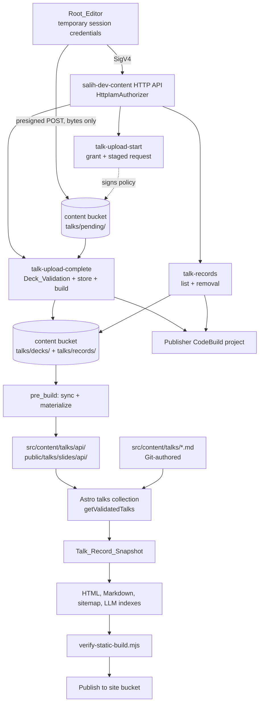
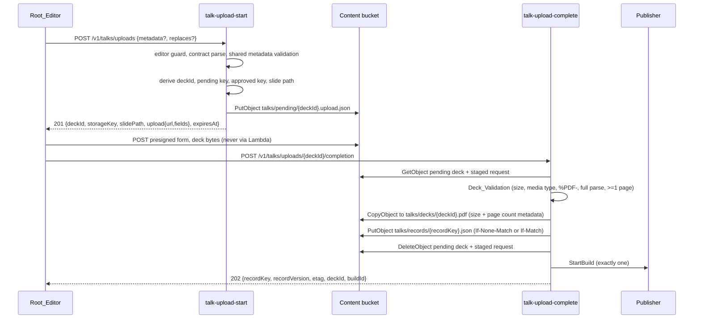

# Design Document: Talk Upload Endpoint

## Overview

The talk upload endpoint adds four routes to the existing `salih-dev-content` HTTP API so the Author can stage a PDF slide deck and, optionally, a complete talk record without a repository commit. Slide bytes never pass through API Gateway or Lambda: the API issues a short-lived, single-object write grant and the Author transfers the deck straight to private storage. A second call validates those untrusted bytes with the same pinned PDF parser the build already uses, records the deck and the talk record in the existing retained content bucket, and starts exactly one publisher build. The publisher materializes API-authored records and their approved decks into a code-owned namespace inside the source tree before validation runs, so from that point on every existing build guarantee applies unchanged.

The feature is deliberately parasitic on machinery that already exists. It adds no bucket, no identity, no public surface, no second validation implementation, and no new verification script. Its whole design problem is the seam between two systems that were both built on the assumption that talk records come from Git.

### Goals

- Extend the existing IAM-authorized content API with talk upload, listing, and removal, reusing its authorizer, allowlist, shared helpers, throttle, and response conventions.
- Prove untrusted PDF bytes are a readable, unencrypted, at-least-one-page document at upload time, using the same parser and options the build uses, without making the parser a site runtime dependency.
- Validate API-supplied talk metadata through the single shared implementation that already validates Git-authored records, so the API cannot be the weaker path.
- Resolve dual-sourced records deterministically: one canonical identity derivation, one record per identity, and a build failure that names the conflict and its sources.
- Preserve every existing static build verification check at its existing strictness for records that never existed in Git.

### Non-goals

- A public page, form, browser control, or unauthenticated route of any kind.
- An additional editor identity, hosted login, identity provider, or long-lived access key.
- Editing Git-authored records or Git-tracked slide files through the API.
- Changing visitor analytics collection, aggregation, storage, or retention.
- Deployment, DNS, or nameserver actions. Both remain separate, explicitly approved operations.

### Repository findings that shape the design

Reading the existing code produced six constraints that determine most of the decisions below.

1. **The content API is a thin, uniform pattern.** `infra/lib/content-api.ts` builds one `HttpApi` with `HttpIamAuthorizer` as the default authorizer, one `NodejsFunction` per route, per-function log groups at one-month retention, one `$default` stage with `throttle: { burstLimit: 10, rateLimit: 5 }`, and object-scoped IAM statements. `infra/functions/content-api-shared.ts` owns `isExpectedEditor`, `jsonResponse`, `requestBody`, `requestHeader`, and `MAX_CONTENT_BYTES = 64 * 1024`. New routes inherit the authorizer and the throttle for free, which satisfies criteria 1.1, 1.6, and 1.7 without new configuration.
2. **Cross-package code reuse already has a precedent, and it works because the imported module is a leaf.** `content-write.ts` does `await import("../../src/config/site-content-schema.js")`. That module has no relative imports and no JSON import, so `infra/tsconfig.json` (`module`/`moduleResolution: Node16`, no `resolveJsonModule`, no `allowJs`) can type-check it. Any shared module reachable from `infra/functions/**` must satisfy the same conditions.
3. **`pdfjs-dist` is a build-time-only dev dependency of the Astro app**, pinned to `6.3.289`, consumed by `src/lib/talks/asset.ts` as `pdfjs-dist/legacy/build/pdf.mjs` with `stopAtErrors: true` and every network/font/canvas capability disabled. Declarations exist at `node_modules/pdfjs-dist/legacy/build/pdf.d.mts`, so a Node16-resolution consumer gets types without `allowJs`. The legacy build resolves its fake worker through `import.meta.url` at runtime, which is what rules out esbuild bundling for Lambda.
4. **The publisher already materializes remote content into the source tree.** The `pre_build` phase of the CodeBuild project in `infra/lib/delivery-stack.ts` copies `site/content.v1.json` and syncs `posts/` and `images/` from the content bucket before `build` runs `npm run import:dev`, `npm test`, `npm run check`, `npm run build`, `npm run verify:build`. Talk materialization is one more `pre_build` step in an established pattern, and `post_build` gates every publication command on `CODEBUILD_BUILD_SUCCEEDING`.
5. **The talks pipeline has exactly one raw-collection read boundary and one asset boundary.** `resolveValidatedTalks` in `src/lib/talks/gateway.ts` validates records and PDFs, aggregates every diagnostic into `TalkValidationError`, and is the only place a snapshot is built. Adding conflict detection there covers both sources at once and needs no consumer change. `src/lib/talks/validation.ts` owns every value rule and is already shared with the Astro schema through `validateTalkCandidate`.
6. **`scripts/verify-static-build.mjs` reads the working tree, not Git.** `readSourceTalks()` walks `src/content/talks` recursively with `readdir(base, { recursive: true })` and treats every `*.md` it finds as the expectation for the built output. Materialized records are therefore verified as ordinary source records by every existing check — publication membership, draft exclusion, ordering, display form, HTML/Markdown equivalence, and the one-to-one slide mapping — with no relaxation and no new verifier for API-authored content. This is the single most important finding: it converts "how do we verify records that are not in Git" from a new subsystem into a materialization-ordering requirement.

Two supporting facts about the transfer path come from service limits rather than this repository: an HTTP API request payload is capped at 10 MB and a synchronous Lambda invocation payload at 6 MB, while base64 transport encoding inflates binary content by roughly a third ([API Gateway quotas](https://docs.aws.amazon.com/apigateway/latest/developerguide/limits.html), [Lambda quotas](https://docs.aws.amazon.com/lambda/latest/dg/gettingstarted-limits.html)). A 25 MiB deck cannot traverse either. Presigned POST, unlike a presigned PUT URL, can carry a policy that pins the exact key, the exact content type, and a `content-length-range` ([S3 presigned POST policy conditions](https://docs.aws.amazon.com/AmazonS3/latest/API/sigv4-HTTPPOSTConstructPolicy.html)), which is what makes criterion 3.3 enforceable by the storage service rather than by trust. Content from external documentation is rephrased for compliance with licensing restrictions.

## Architecture

### System context



### Upload sequence



### Route inventory

| Route                                        | Purpose                                          | Body cap                    | Preconditions                                             | Success          |
| -------------------------------------------- | ------------------------------------------------ | --------------------------- | --------------------------------------------------------- | ---------------- |
| `POST /v1/talks/uploads`                     | The one route that accepts a Talk_Upload_Request | 65,536 bytes                | `If-Match` semantics carried in the `replaces` member     | `201` grant      |
| `POST /v1/talks/uploads/{deckId}/completion` | Deck_Validation, store, build start              | body must be absent or `{}` | none                                                      | `202` publishing |
| `GET /v1/talks/records`                      | List stored API records with their versions      | n/a                         | none                                                      | `200` list       |
| `DELETE /v1/talks/records/{recordKey}`       | Removal with explicit intent                     | n/a                         | `If-Match` required, `x-talk-removal: confirmed` required | `202` publishing |

Criterion 2.1 is satisfied because exactly one route accepts a Talk_Upload_Request. The completion, listing, and removal routes accept different request kinds. `GET /v1/talks/records` exists because criterion 9.1 requires the caller to present the version returned when a record was last stored; without a read path, a lost `ETag` would make replacement and removal permanently impossible. It returns metadata and versions only, never deck bytes.

### Storage layout

Everything reuses the existing retained content bucket from `SalihDevStateStack`: `BLOCK_ALL` public access, `S3_MANAGED` encryption, `enforceSSL`, versioned, `RemovalPolicy.RETAIN`, 90-day noncurrent version expiration. No new bucket is created, which is how criterion 10.7 is satisfied — by inheritance rather than by re-implementation.

| Prefix                               | Contents                                                         | Written by                 | Read by                     |
| ------------------------------------ | ---------------------------------------------------------------- | -------------------------- | --------------------------- |
| `talks/pending/{deckId}.pdf`         | Pending_Deck bytes                                               | Author, via presigned POST | complete                    |
| `talks/pending/{deckId}.upload.json` | Staged Talk_Upload_Request                                       | start                      | complete                    |
| `talks/decks/{deckId}.pdf`           | Approved_Deck, with `byte-length` and `page-count` user metadata | complete                   | publisher, records (delete) |
| `talks/records/{recordKey}.json`     | API_Authored_Talk_Record                                         | complete                   | publisher, records          |

The pending/approved prefix split is what makes criterion 3.7 structural rather than procedural: the publisher syncs only `talks/decks/`, so a deck that has not passed validation cannot reach a snapshot even if the materializer had a bug. One prefix-scoped lifecycle rule expires objects under `talks/pending/` after one day so abandoned transfers do not accumulate. It touches no existing rule and no existing prefix.

### Architectural decisions

| Decision                                                                 | Rationale                                                                                                                                                                                                                                                                               |
| ------------------------------------------------------------------------ | --------------------------------------------------------------------------------------------------------------------------------------------------------------------------------------------------------------------------------------------------------------------------------------- |
| Presigned POST, not presigned PUT                                        | Only a POST policy can pin the exact key, the exact content type, and a byte range in one signed document, which is what criteria 3.1 and 3.3 require. A presigned PUT URL cannot constrain size at all.                                                                                |
| Bytes bypass Lambda entirely                                             | A 25 MiB deck exceeds the HTTP API payload cap, the synchronous Lambda payload cap, and the 65,536-byte request cap of criterion 2.7. Direct transfer also keeps deck bytes out of API access logs and Lambda memory pressure on the request path.                                      |
| Two calls: grant then completion                                         | Validation cannot run before bytes exist, and criterion 4.7 requires the validation outcome and the violated criterion in a response. An S3 event trigger would validate asynchronously with nowhere to return the diagnostic.                                                          |
| `pdfjs-dist` installed into the Lambda asset, not bundled                | The legacy build resolves its fake worker relative to `import.meta.url`; esbuild bundling breaks that resolution. `bundling.nodeModules` makes CDK install the real package into the asset, and the root package keeps it as a dev dependency, so the site gains no runtime dependency. |
| Reuse the retained content bucket                                        | Same encryption, TLS, versioning, retention, and public-access posture the requirements demand, and the publisher role already has read/write on it. A new bucket would be new attack surface and new retention policy to get right.                                                    |
| Record key derived from Talk_Identity                                    | Makes S3 itself the uniqueness authority: `If-None-Match: *` on an identity-derived key is exactly criterion 7.7, and one key per identity is exactly criterion 9.4. No lock, no index, no scan.                                                                                        |
| Materialize into `src/content/talks/api/` and `public/talks/slides/api/` | Reserved, gitignored, code-owned subdirectories inside the paths Astro and the verifier already read. This gives source separation (criterion 7.6) while keeping one collection, one gateway, one verifier, and one glob.                                                               |
| Conflict detection in `resolveValidatedTalks`                            | The gateway is the only place a snapshot exists, so identity and deck collisions are detected once for both sources, aggregated into the existing deterministic diagnostic, and surfaced in `npm run build` and `npm test` locally.                                                     |
| No new verifier for API records                                          | The verifier reads the working tree. Because materialization happens in `pre_build`, API records are indistinguishable from Git records to every existing check. Two additive checks are added; none is relaxed.                                                                        |
| Replacement may not change identity                                      | Changing title or date changes the identity and therefore the key, which would leave two current records for one talk. Rejecting the identity change keeps criterion 9.4 true without a cross-key transaction.                                                                          |

### Publisher changes

Two `pre_build` commands and one materialization step are added, after the existing content synchronization and before the `build` phase:

```sh
mkdir -p src/content/talks/api public/talks/slides/api "$TALK_RECORD_CACHE_PATH" "$TALK_DECK_CACHE_PATH"
aws s3 sync "s3://$CONTENT_BUCKET/talks/records/" "$TALK_RECORD_CACHE_PATH" --delete --only-show-errors
aws s3 sync "s3://$CONTENT_BUCKET/talks/decks/" "$TALK_DECK_CACHE_PATH" --delete --only-show-errors
npm run materialize:talks
```

`post_build` is unchanged. In particular, nothing syncs `src/content/talks/` or `public/talks/slides/` back to the content bucket: those trees are derived from the store on every build, not authored in the build workspace. `--delete` on the inbound syncs plus a clear-then-write materializer is what makes removal take effect (criteria 9.6 and 9.7) without a compensating delete path in the build.

The publisher role already has `grantReadWrite` on the content bucket, so no new IAM statement is required for the new prefixes.

## Components and Interfaces

### Shared modules (consumed by the site build, the publisher, and Lambda)

Every module in this section lives under `src/lib/talks/` and is reachable from `infra/functions/**`. Each therefore uses explicit `.js` relative specifiers so `infra`'s Node16 resolution accepts it, and none imports JSON or a `.js`-only package. This is the constraint from finding 2 stated as a rule.

#### `identity.ts` (new, leaf)

```ts
export type TalkIdentity = string & Readonly<{ __talkIdentity: true }>;
export type TalkRecordKey = string & Readonly<{ __talkRecordKey: true }>;

export function deriveTalkIdentity(date: string, title: string): TalkIdentity;
export function deriveTalkRecordKey(identity: TalkIdentity): TalkRecordKey;
export function isTalkRecordKey(value: string): boolean;
```

`deriveTalkIdentity` case-folds and collapses internal whitespace exactly as criterion 7.2 specifies: NFC-normalize, trim, replace every whitespace run with one space, lowercase, and join with the ISO date under a separator that cannot appear in a validated date. `deriveTalkRecordKey` returns `{date}-{first 16 hex characters of the SHA-256 of the identity}`, which is filesystem-safe, contains no author text, is stable for an identity, and doubles as the Astro collection id suffix. Hashing uses `node:crypto`, available in Node 22 build hosts and the Node 24 Lambda runtime alike.

#### `deck.ts` (new, leaf)

```ts
export const DECK_MIN_BYTES = 1;
export const DECK_MAX_BYTES = 26_214_400;
export const DECK_MEDIA_TYPE = "application/pdf";
export const PENDING_DECK_PREFIX = "talks/pending/";
export const APPROVED_DECK_PREFIX = "talks/decks/";
export const API_SLIDE_PREFIX = "/talks/slides/api/";

export type DeckId = string & Readonly<{ __deckId: true }>;

export function createDeckId(): DeckId; // randomUUID
export function isDeckId(value: string): boolean;
export function pendingDeckKey(id: DeckId): string;
export function pendingRequestKey(id: DeckId): string;
export function approvedDeckKey(id: DeckId): string;
export function deckSlidePath(id: DeckId): string; // /talks/slides/api/{id}.pdf
export function deckIdFromSlidePath(path: string): DeckId | null;
```

Every key and path is a function of a code-generated UUID and a code-owned prefix, which is criterion 5.1. `deckIdFromSlidePath` is the inverse the materializer uses to locate the cached deck for a record, and it is what makes the round trip of Property 3 meaningful.

#### `pdf-document.ts` (new, leaf apart from the parser)

Extracted verbatim from the byte-level half of `src/lib/talks/asset.ts` so exactly one implementation exists:

```ts
export const PDF_SIGNATURE = "%PDF-";
export type PdfRejection = Readonly<{
  kind: "signature" | "encrypted" | "malformed" | "empty";
  message: string;
}>;
export type PdfDocumentResult =
  | Readonly<{ ok: true; pageCount: number }>
  | Readonly<{ ok: false; rejection: PdfRejection }>;

export function hasPdfSignature(bytes: Uint8Array): boolean;
export async function readPdfDocument(
  bytes: Uint8Array,
): Promise<PdfDocumentResult>;
```

`readPdfDocument` keeps the existing option set (`stopAtErrors: true`, `verbosity: ERRORS`, `disableFontFace`, `useSystemFonts: false`, `useWorkerFetch: false`, `isOffscreenCanvasSupported: false`, `isImageDecoderSupported: false`), retrieves every page so a damaged page tree fails, classifies `PasswordException` and `InvalidPDFException`, and always destroys the loading task. One option is added for both callers: `isEvalSupported: false`. That is strictly narrower than today's build behavior, changes no acceptance outcome, and removes a code-generation path from the component that now sees untrusted input.

`asset.ts` keeps its filesystem responsibilities (path resolution, `realpath` containment, read, zero-byte rejection, diagnostics) and delegates the byte checks to this module. Its exported behavior and diagnostics are unchanged, so criterion 4.9 holds by construction: a materialized deck is validated by the same `validatePdfAsset` that validates Git-tracked decks.

#### `upload-request.ts` (new)

```ts
export type TalkUploadRequest = Readonly<{
  metadata: TalkFrontmatter | null;
  replaces: Readonly<{ recordKey: TalkRecordKey; version: string }> | null;
}>;
export type UploadRequestResult =
  | Readonly<{ ok: true; request: TalkUploadRequest }>
  | Readonly<{ ok: false; issues: readonly UploadIssue[] }>;

export function parseTalkUploadRequest(
  body: unknown,
  slidePath: string,
): UploadRequestResult;
```

The contract is closed: exactly `metadata` and `replaces` at the top level, exactly the Approved_Talk_Fields minus `slides` inside `metadata`, and exactly `recordKey` and `version` inside `replaces`. Any other member is reported by name, which covers criterion 2.6 and — because `slides`, `slidePath`, `key`, and `filename` are all simply unsupported members — criterion 5.3 with the same rule rather than a second one.

Metadata meaning is not re-implemented. The parser injects the code-derived `slides` value and calls `normalizeTalkCandidate` from `src/lib/talks/validation.ts`, the same function `src/content.config.ts` calls through `validateTalkCandidate`. Diagnostics keep their `(field, criterion)` pairs. This is the mechanism behind criteria 6.1, 6.2, 6.3, 6.5, and 11.3, and the reason Property 5 can be a differential test against the Git-side validator rather than a restatement of its rules.

Two additional constraints apply to API metadata only, and both are strictly narrower than the repository schema, never weaker:

1. Text fields must contain no control character, line separator, or backslash. Materialized frontmatter is emitted as double-quoted JSON scalars, and the verifier's deliberately small frontmatter parser resolves only `\"` and `\'`. Forbidding values that would need any other escape keeps the materialized record exactly round-trippable through both the Astro YAML parser and the verifier's parser.
2. A `replaces` request must not change the derived Talk_Identity, for the reason given in the decisions table.

#### `api-record.ts` (new)

```ts
export type ApiTalkRecord = Readonly<{
  schemaVersion: 1;
  talkIdentity: TalkIdentity;
  recordKey: TalkRecordKey;
  deckId: DeckId;
  deck: Readonly<{ byteLength: number; pageCount: number }>;
  createdAt: string;
  updatedAt: string;
  frontmatter: TalkFrontmatter;
}>;

export function serializeApiTalkRecord(record: ApiTalkRecord): string;
export function parseApiTalkRecord(value: unknown): ApiTalkRecord | null;
export function toTalkFrontmatterDocument(record: ApiTalkRecord): string;
```

`frontmatter` holds exactly the validated Approved_Talk_Fields plus the derived `slides` association, which is criterion 6.4. `toTalkFrontmatterDocument` emits a frontmatter-only Markdown document with an empty body, scalar values as JSON strings, and `eventTypes` as a two-space block sequence — the shape both the Astro schema and `verify-static-build.mjs` already parse.

#### `materialize.ts` (new)

```ts
export type MaterializationPlan = Readonly<{
  records: readonly Readonly<{
    recordPath: string;
    document: string;
    deckSource: string;
    deckTarget: string;
  }>[];
  skipped: readonly Readonly<{ recordKey: string; reason: "deck_absent" }>[];
}>;

export function planMaterialization(
  records: readonly ApiTalkRecord[],
  availableDeckIds: ReadonlySet<string>,
  roots: Readonly<{ recordRoot: string; slideRoot: string }>,
): MaterializationPlan;
```

Pure. Selects records whose approved deck is present (criteria 7.1 and 7.8), derives every target path, and proves each resolves inside its code-owned root (criteria 5.6 and 5.7). Records with an absent deck are skipped rather than fatal, because criterion 7.8 excludes them from the snapshot rather than failing the build. A deck with no record produces no target, which is criterion 8.3 in the other direction.

### `scripts/materialize-api-talks.mjs` (new)

The thin I/O shell around `planMaterialization`, invoked as `npm run materialize:talks` (`node --import tsx scripts/materialize-api-talks.mjs`, matching the existing `import:dev` convention and `tsx` usage in `npm test`). It:

1. removes and recreates `src/content/talks/api/` and `public/talks/slides/api/`, so a removed record leaves no residue;
2. reads and parses every cached record, failing on a record the shared parser rejects;
3. writes each planned Markdown document and copies each planned deck;
4. writes nothing outside the two roots, and reads the store only from the local cache directories, never from S3, so it cannot mutate the store (criterion 6.7);
5. prints one summary line, consistent with the other scripts.

`mkdir -p src/content/talks/api` incidentally guarantees `src/content/talks/` exists in the publisher workspace, which the verifier's `readSourceTalks()` requires.

### `src/lib/talks/gateway.ts` changes

Two additions to `resolveValidatedTalks`, alongside the existing duplicate-id check and in the same aggregate `TalkValidationError`:

```ts
function talkSource(id: string): "api" | "git"; // id.startsWith("api/")
function conflictIssues(talks: readonly ValidatedTalk[]): ValidationIssue[];
```

`conflictIssues` groups records by `deriveTalkIdentity(talk.date, talk.title)` and by `talk.slidePath`, and emits one diagnostic per collision naming the colliding value and the source of each participating record. Where at least one participant is Git-authored, the message names the API-authored record as the one to remove, which is criterion 7.5's authority rule expressed as remediation text rather than as silent precedence. Drafts participate, because a Record_Conflict is defined over the snapshot and the snapshot includes drafts.

`TalkCriterion` gains `"5.7"`, `"7.4"`, and `"7.6"`. The talks-section criteria in that union are `2.x` and `6.x`, so the new identifiers do not collide, and `compareValidationIssues` keeps diagnostics deterministic without change. No other gateway behavior moves: the snapshot is still built once, drafts are still excluded by `selectPublishedTalks`, and ordering is untouched.

### `src/config` change

`deriveSlidePublicUrl` is the only reason `validation.ts` imports `site`, and `src/config/site.ts` transitively reads the filesystem and imports JSON. A new leaf `src/config/site-origin.ts` exports `SITE_ORIGIN = "https://salih.dev"`; `site.ts` uses it for `url` and `validation.ts` imports it directly. One origin, one source of truth, and the Lambda bundle no longer contains site content, `Intl` formatting, or a JSON import that `infra`'s tsconfig cannot resolve.

### `scripts/verify-static-build.mjs` changes

No existing check is modified, relaxed, or given an API-specific exemption. Materialized records are verified as source records by everything already there. Two checks are added:

1. Every source record's derived Talk_Identity is unique across all source records. This is a second, independent line of defence for criterion 7.4 that would still fail if the gateway check regressed.
2. A record under `src/content/talks/api/` references a slide path beneath `/talks/slides/api/`, and a record outside that directory does not. This keeps the two namespaces provably separate in the built output.

### Lambda functions

Three new `NodejsFunction` constructs in `ContentApi`, following the existing shape (ARM64, Node 24, minified bundling, `depsLockFilePath` at `infra/package-lock.json`, `projectRoot` at the repository root, a dedicated log group at one-month retention, and `suppressBasicLambdaLoggingPolicy`). Every one calls `isExpectedEditor` before any other work, so criterion 1.4 holds by ordering.

| Function               | Memory / timeout | Extra config                           | IAM                                                                                                                                                                                               |
| ---------------------- | ---------------- | -------------------------------------- | ------------------------------------------------------------------------------------------------------------------------------------------------------------------------------------------------- |
| `talk-upload-start`    | 256 MB / 10 s    | —                                      | `PutObject` on `talks/pending/*`; `GetObject` on `talks/records/*`                                                                                                                                |
| `talk-upload-complete` | 1769 MB / 29 s   | `bundling.nodeModules: ["pdfjs-dist"]` | `GetObject`/`DeleteObject` on `talks/pending/*`; `GetObject`/`PutObject`/`DeleteObject` on `talks/decks/*`; `GetObject`/`PutObject` on `talks/records/*`; `codebuild:StartBuild` on the publisher |
| `talk-records`         | 256 MB / 10 s    | GET and DELETE on one handler          | `ListBucket` on the bucket restricted to the `talks/records/` prefix; `GetObject`/`DeleteObject` on `talks/records/*`; `DeleteObject` on `talks/decks/*`; `codebuild:StartBuild` on the publisher |

The start function's grant is signed with its own role, so the role's IAM is the ceiling on what any issued grant can do. Limiting it to `PutObject` under `talks/pending/*` is what makes criterion 3.4 true even against a tampered policy, rather than relying on the policy conditions alone.

`talk-upload-complete` gets the higher memory because parsing a 25 MiB document holds the bytes and the parser's page structures at once, and memory determines CPU share. Its timeout is 29 seconds, just inside the HTTP API's 30-second integration limit, so a pathological document produces the function's own logged failure rather than a gateway timeout over a still-running invocation. Either way the outcome is fail-closed, as described under Error Handling.

`pdfjs-dist@6.3.289` is added to `infra/package.json` dependencies at the identical pin, and `@aws-sdk/s3-presigned-post` at the same version as the other SDK clients (`3.1127.0`). A test asserts the two `pdfjs-dist` pins are equal, so "the same exact-pinned parser" (criterion 4.4) is machine-checked rather than asserted in prose. The root package keeps `pdfjs-dist` in `devDependencies`, so the site's runtime dependency set is unchanged.

### Deck_Validation

`talk-upload-complete` performs, in order:

1. `HeadObject`/`GetObject` on the pending deck. Absent object means the transfer never happened.
2. Recorded content type is exactly `application/pdf` and `ContentLength` is within `1..26,214,400` (criterion 4.2).
3. `hasPdfSignature` on the bytes (criterion 4.3).
4. `readPdfDocument` — full parse, every page retrieved, strict mode, pinned parser (criterion 4.4).
5. Page count at least one (criterion 4.5); encryption classified and rejected (criterion 4.6).

Only after all five does anything become durable. On rejection, the response names the violated criterion, nothing is written to `talks/decks/` or `talks/records/`, and the pending objects are left for the lifecycle rule to expire, so a rejected upload leaves no state a later build could observe (criterion 4.7). On acceptance, `CopyObject` with `MetadataDirective: REPLACE` records the validated byte length and page count on the approved object (criterion 4.8).

## Data Models

### Talk_Upload_Request

```jsonc
{
  "metadata": {
    // optional; omit for a deck-only upload
    "title": "Building agent-ready static websites",
    "eventName": "Example Conference",
    "date": "2026-06-18",
    "location": "Berlin, Germany",
    "eventUrl": "https://conference.example/talks/agent-ready",
    "eventTypes": ["Conference"],
    "videoUrl": "https://www.youtube.com/watch?v=abcdefghijk", // optional
    "draft": false, // optional, defaults false
  },
  "replaces": {
    // optional; required to replace a stored record
    "recordKey": "2026-06-18-3f2a9c1d5b7e4a60",
    "version": "\"9b2cf1...\"",
  },
}
```

`slides` is absent by contract. Supplying it, or any storage-shaped member, is an unsupported member.

### Grant response

```jsonc
{
  "deckId": "0f9c8c46-2f1e-4a5b-9d3e-71b0d2c9a4e8",
  "storageKey": "talks/pending/0f9c8c46-2f1e-4a5b-9d3e-71b0d2c9a4e8.pdf",
  "approvedStorageKey": "talks/decks/0f9c8c46-2f1e-4a5b-9d3e-71b0d2c9a4e8.pdf",
  "slidePath": "/talks/slides/api/0f9c8c46-2f1e-4a5b-9d3e-71b0d2c9a4e8.pdf",
  "recordKey": "2026-06-18-3f2a9c1d5b7e4a60", // present only with metadata
  "expiresAt": "2026-02-01T10:30:00.000Z",
  "upload": {
    "url": "https://…",
    "fields": { "key": "…", "policy": "…", "…": "…" },
  },
}
```

### Grant policy

One presigned POST per request, expiring at most 900 seconds after issue (criterion 3.2), with conditions: `key` equal to exactly the pending key, `Content-Type` equal to exactly `application/pdf`, and `content-length-range` exactly `1, 26214400`. No prefix condition, no wildcard, no second key (criteria 3.1 and 3.3).

### API_Authored_Talk_Record

```jsonc
{
  "schemaVersion": 1,
  "talkIdentity": "2026-06-18|building agent-ready static websites",
  "recordKey": "2026-06-18-3f2a9c1d5b7e4a60",
  "deckId": "0f9c8c46-2f1e-4a5b-9d3e-71b0d2c9a4e8",
  "deck": { "byteLength": 1842577, "pageCount": 24 },
  "createdAt": "2026-02-01T10:22:41.118Z",
  "updatedAt": "2026-02-01T10:22:41.118Z",
  "frontmatter": {
    "title": "Building agent-ready static websites",
    "eventName": "Example Conference",
    "date": "2026-06-18",
    "location": "Berlin, Germany",
    "eventUrl": "https://conference.example/talks/agent-ready",
    "eventTypes": ["Conference"],
    "slides": "/talks/slides/api/0f9c8c46-2f1e-4a5b-9d3e-71b0d2c9a4e8.pdf",
    "videoUrl": "https://www.youtube.com/watch?v=abcdefghijk",
    "draft": false,
  },
}
```

### Materialized record

`src/content/talks/api/2026-06-18-3f2a9c1d5b7e4a60.md`, collection id `api/2026-06-18-3f2a9c1d5b7e4a60`:

```markdown
---
title: "Building agent-ready static websites"
eventName: "Example Conference"
date: "2026-06-18"
location: "Berlin, Germany"
eventUrl: "https://conference.example/talks/agent-ready"
eventTypes:
  - "Conference"
slides: "/talks/slides/api/0f9c8c46-2f1e-4a5b-9d3e-71b0d2c9a4e8.pdf"
videoUrl: "https://www.youtube.com/watch?v=abcdefghijk"
draft: false
---
```

The `api/` id prefix is reserved: it is the source discriminator the gateway uses for conflict diagnostics, and both materialization roots are gitignored. A Git-authored record could only appear there through a deliberate forced add; because the materializer clears the directory in the build workspace only, such a record would be ignored by the build and would never modify the repository.

### Versions and preconditions

The record store's `ETag` is the version in criteria 9.1 through 9.4. Creation uses `If-None-Match: *`, which makes identity uniqueness a storage guarantee (criterion 7.7). Replacement uses `If-Match` with the supplied version. Removal uses a conditional `DeleteObject` with `If-Match`. Deck objects carry no independent version: a deck is replaced by uploading a new one, and the superseded object is deleted, leaving a recoverable noncurrent version under the bucket's existing 90-day policy.

## Correctness Properties

_A property is a characteristic or behavior that should hold true across all valid executions of a system — essentially, a formal statement about what the system should do. Properties serve as the bridge between human-readable specifications and machine-verifiable correctness guarantees._

Reflection consolidated criteria that exercise one invariant. The grant's cardinality, expiry, media type, size range, and response fields are one property rather than seven. The unsupported-member rule covers storage-shaped members, so criterion 5.3 needs no separate property. Key safety, distinctness, and traversal-freedom are one property, while the key-to-path inverse stays separate because it is a round trip. Metadata acceptance equivalence, per-field diagnostics, and the draft default are one differential property; record serialization is separate because it is a round trip, not an equivalence. Snapshot membership, multiplicity, conflict detection, and conflict remediation are one property. Every statement about which paths materialization touches and which records reach the tree is one confinement property. PDF acceptance, IAM authorization, route and stage configuration, log retention, storage protections, and the absence of public surface remain fixture, example, or template-assertion tests rather than being restated as weak properties.

### Property 1: Every accepted upload issues exactly one fully constrained grant

For any accepted Talk_Upload_Request, the response contains exactly one Slide_Upload_Grant whose policy pins exactly one storage key with an equality condition, a media type of exactly `application/pdf`, and a byte range of exactly 1 to 26,214,400, whose expiry is after the issue instant and no more than 900 seconds after it, and whose response carries that storage key reference and that expiry instant; a staged talk record exists for that grant if and only if the request supplied a Talk_Metadata_Payload, and when one exists its deck reference is the grant's derived deck identifier.

**Validates: Requirements 2.2, 2.3, 2.4, 2.5, 3.1, 3.2, 3.3**

### Property 2: Derived storage keys and slide paths are safe, code-owned, and distinct

For any sequence of issued grants, every derived pending key, approved key, and slide path begins with its code-owned prefix and ends in `.pdf`, contains no path-traversal segment, no separator outside the code-owned prefix, no whitespace, no control character, and no percent-encoded sequence, every derived slide path is accepted by the existing safe-slide-path validator and resolves inside the API slide directory, and every pair of grants in the sequence has distinct keys and distinct slide paths.

**Validates: Requirements 5.1, 5.2, 5.4, 5.5**

### Property 3: Storage key and slide path round trip

For any code-generated deck identifier, deriving the slide path and then recovering the deck identifier from that path returns the original identifier, and recovery returns nothing for any value that is not a slide path derived by this feature.

**Validates: Requirements 5.2, 8.3**

### Property 4: Unsupported request members are always rejected and named

For any otherwise valid Talk_Upload_Request extended with any set of members outside the code-owned request contract, at any level of the contract, the request is rejected, every added member name appears in the reported diagnostics, no Slide_Upload_Grant is issued, and no store mutation is attempted.

**Validates: Requirements 2.6, 5.3, 6.2**

### Property 5: API metadata validation is exactly repository metadata validation

For any candidate Talk_Metadata_Payload, the Talk_Upload_API accepts it if and only if the shared repository validator accepts the same field values together with a code-derived slide association, and when it rejects, the reported set of field-and-criterion pairs equals the set the shared validator reports; every accepted payload yields the same normalized values and the same draft state the repository validator yields, including when the draft state is omitted.

**Validates: Requirements 6.1, 6.3, 6.5, 11.3**

### Property 6: Stored record and materialized record round trip

For any accepted Talk_Metadata_Payload and derived deck association, serializing the resulting API_Authored_Talk_Record to its stored representation and to its materialized frontmatter document and parsing each back yields exactly the validated Approved_Talk_Fields plus the derived slide association, with no field added, lost, or altered.

**Validates: Requirements 6.4**

### Property 7: Talk identity derivation is canonical and source-independent

For any two talk records, their derived Talk_Identity values are equal if and only if their dates are equal and their titles are equal after Unicode NFC normalization, trimming, collapsing internal whitespace runs, and locale-independent case folding; the derived identity is unchanged by the record's identifier, storage location, source, draft state, or any field other than date and title.

**Validates: Requirements 7.2**

### Property 8: Equal identity derives equal record key

For any pair of talk records, their derived record keys are equal if and only if their derived Talk_Identity values are equal, and every derived record key matches the code-owned key form with no author text, no path separator, and no character outside the safe key alphabet.

**Validates: Requirements 7.7, 9.4**

### Property 9: The snapshot is complete, unique, and reports every conflict with its sources

For any finite set of Git-authored and API-authored talk records, resolving the snapshot either returns a value containing every supplied record exactly once, or fails; it fails exactly when two records share a derived Talk_Identity or reference the same slide deck, and every such failure reports the colliding identity or deck together with the source of each participating record, and where at least one participant is Git-authored the reported remediation names an API-authored record for removal and never names a repository change.

**Validates: Requirements 7.1, 7.3, 7.4, 7.5**

### Property 10: Materialization is confined to the code-owned API namespace

For any set of stored API records and available approved decks, the set of paths materialization creates, modifies, or removes is a subset of the two code-owned API directories; the materialized records are exactly those records whose referenced approved deck is available; the materialized decks correspond one-to-one with the materialized records; every materialized deck path resolves inside the API slide directory; and no path belonging to a Git-authored record or a Git-tracked slide file is created, modified, or removed.

**Validates: Requirements 3.7, 5.6, 5.7, 7.6, 7.8, 8.3, 9.6, 11.4**

### Property 11: Version preconditions decide every mutating request

For any combination of target-record presence, supplied precondition presence, and precondition correctness, a request that identifies an existing target without a precondition is rejected as precondition-required, a request whose precondition does not match the stored version is rejected as a precondition failure, a mutation is attempted only when a precondition is present and matching, and in every rejecting case neither the deck store nor the record store is mutated.

**Validates: Requirements 9.1, 9.2, 9.3, 9.5**

### Property 12: Removal resolves by owning store

For any pair of Git-authored and API-authored record sets and any removal target, removal succeeds only for a Talk_Identity held by the API record store, removal of a Talk_Identity held only by Git-authored records is rejected as repository-authored, and every rejected removal leaves the record store and the deck store unchanged.

**Validates: Requirements 9.8**

### Property 13: Rejected deck bytes name a criterion and record nothing

For any byte sequence and recorded media type, Deck_Validation rejects the deck whenever the media type is not `application/pdf`, the byte length is outside 1 to 26,214,400, or the bytes do not begin with `%PDF-`; every rejection reports exactly one violated criterion identifier from the approved deck-validation criteria; and no rejection records an Approved_Deck, records an API_Authored_Talk_Record, or starts a Publication_Build.

**Validates: Requirements 4.2, 4.3, 4.7**

### Property 14: Upload log records carry only permitted fields

For any authorization outcome, validation outcome, or store change, every emitted Upload_Log_Record has a field set drawn only from the fields the requirements permit for that record kind, contains no client IP address, forwarded IP address, cookie, query string, user agent, referrer, or browser or device identifier at any nesting depth, and contains no PDF byte content and no rendered page content.

**Validates: Requirements 10.2, 10.3, 10.4, 10.5**

## Error Handling

### Response contract

Every response is produced by the existing `jsonResponse` helper, so every response carries `cache-control: no-store` and `content-type: application/json; charset=utf-8`, and every error body is `{ "error": "<identifier>", … }` exactly as the current content routes do.

| Status | Identifier                                    | Condition                                                                                                                            |
| ------ | --------------------------------------------- | ------------------------------------------------------------------------------------------------------------------------------------ |
| `403`  | platform `Forbidden`                          | Missing, invalid, or expired signature. API Gateway rejects before the handler runs (criterion 1.3).                                 |
| `403`  | `forbidden`                                   | Signed by a caller outside the allowlist (criterion 1.4).                                                                            |
| `400`  | `invalid_request`                             | Body is not JSON, or the completion request carries a body other than `{}`.                                                          |
| `400`  | `unsupported_member`                          | One or more members outside the request contract, each named (criteria 2.6, 5.3).                                                    |
| `400`  | `invalid_metadata`                            | Metadata rejected, reported as `[{ field, criterion, message }]` (criterion 6.3).                                                    |
| `400`  | `invalid_precondition`                        | `replaces.version` or `if-match` is malformed.                                                                                       |
| `409`  | `talk_identity_conflict`                      | The derived identity is already held by a stored API record (criterion 7.7).                                                         |
| `409`  | `talk_identity_change_unsupported`            | A `replaces` request would change the target's identity.                                                                             |
| `409`  | `repository_authored_talk`                    | Removal targets an identity held only by Git (criterion 9.8).                                                                        |
| `412`  | `record_changed`                              | The supplied version does not match the stored version (criterion 9.2).                                                              |
| `413`  | `content_too_large`                           | Request body over 65,536 bytes (criterion 2.7).                                                                                      |
| `422`  | `deck_validation_failed`                      | Deck_Validation rejected the bytes; the body names the violated criterion (criterion 4.7).                                           |
| `428`  | `precondition_required`                       | An existing target was identified without a version, or removal omitted `if-match` or the removal-intent header (criteria 9.3, 9.5). |
| `404`  | `pending_deck_not_found`                      | Completion for a deck whose pending object is absent or expired.                                                                     |
| `404`  | `record_not_found`                            | Replacement or removal target absent.                                                                                                |
| `500`  | `talk_upload_failed`, `deck_validation_error` | Unexpected storage or parser failure; details logged, never returned.                                                                |
| `503`  | `publication_not_started`                     | Records are stored but `StartBuild` failed; the body identifies the stored records (criterion 8.8).                                  |

`422` distinguishes deck-byte rejection from request-shape rejection: by the time completion runs, the request itself is well formed and the payload under judgement is the object in storage. `403` for an unsigned request is API Gateway's behavior for an `AWS_IAM` route, inherited unchanged.

### Failure modes

| Condition                                          | Behavior                                                                                                                                                                                                                            |
| -------------------------------------------------- | ----------------------------------------------------------------------------------------------------------------------------------------------------------------------------------------------------------------------------------- |
| Grant issued, transfer never made                  | The pending objects never appear; the lifecycle rule expires the staged request. No approved deck, no record, no build.                                                                                                             |
| Grant expired before transfer                      | S3 rejects the form post. Any previously stored bytes at that key are untouched, and the key is unique per grant so there are none (criterion 3.5).                                                                                 |
| Wrong media type or oversize transfer              | S3 rejects against the signed policy conditions, so no Pending_Deck exists (criterion 3.6).                                                                                                                                         |
| Deck rejected by validation                        | `422` naming the criterion; nothing durable is written; pending objects expire (criterion 4.7).                                                                                                                                     |
| Pathological document exhausts time or memory      | The function times out or is killed, API Gateway returns an error, and nothing durable is written. Fail-closed: the deck remains a Pending_Deck and is therefore excluded from every snapshot.                                      |
| Record stored, `StartBuild` fails                  | `503 publication_not_started` identifying the stored records; the records are retained and the next scheduled or manual build publishes them (criterion 8.8).                                                                       |
| Deck approved, record write fails the precondition | `412`; the approved deck exists but no record references it, so it is never materialized and never published.                                                                                                                       |
| Materialized record fails Build_Validation         | The existing aggregate `TalkValidationError` fails the build; `post_build` publishes nothing; the previously published site stands; the store is untouched because the materializer only reads the local cache (criteria 6.7, 8.6). |
| Record_Conflict in the snapshot                    | The gateway fails before generation, naming the identity or deck and each source, and instructing removal of the API record (criteria 7.4, 7.5).                                                                                    |
| Removal of a record whose deck is already gone     | The record is removed and the missing deck is treated as already absent; the next build materializes neither.                                                                                                                       |
| Concurrent builds                                  | The publisher keeps `concurrentBuildLimit: 1`, so a build started by an upload while another runs is queued rather than racing.                                                                                                     |

No error path returns deck bytes, storage credentials, parser internals, or an S3 error message to the caller, and no error path writes visitor data.

## Security Review

Accepting untrusted bytes is the only genuinely new risk in this feature. The surface and the mitigations:

- **Parser exposure to hostile documents.** A malformed PDF is now processed by `pdfjs-dist` inside a Lambda function rather than only by the Author's own build. The function has no inbound network path other than the API, no outbound network need, and no filesystem writes. The parser is configured with no worker fetch, no system fonts, no font face loading, no offscreen canvas, no image decoder, and — added by this design — no eval. Bytes are passed as an in-memory `Uint8Array`, never as a URL, so the parser cannot be steered into a request. The function's role can write only to `talks/decks/*` and `talks/records/*`; a parser compromise gains no read of site content, no CloudFront access, and no ability to publish, because publication requires `codebuild:StartBuild` on one project whose source is an immutable S3 asset.
- **Resource exhaustion.** The signed policy caps a transfer at 25 MiB, so decompression and page-tree work are bounded by input size. A document engineered to be slow or memory-hungry within that cap fails the function rather than the store, and the stage throttle (5 requests per second, burst 10) plus a single-caller allowlist bound the attempt rate. Cost exposure is bounded further by `concurrentBuildLimit: 1` on the publisher and the one-day expiry of the pending prefix.
- **Path injection.** No caller value reaches a storage key, a file name, or a slide path. Keys are a code-owned prefix plus a UUID; the slide path is derived from the key; the materialized target is proven to resolve inside its code-owned root; and the existing `validateSlidePath` and `realpath` containment checks still run at build time. Property 2 and Property 10 are the machine-checked statements of this.
- **Grant misuse.** The presigned policy pins one key, one media type, and one size range, and the signing role can write nowhere else, so the grant cannot be widened by editing it. It confers no read, list, or delete.
- **Content injection into published output.** Author text still flows only through the shared validators and the shared Markdown serializer, which escapes structural characters and emits URLs only as bracketed destinations. Video embedding is still restricted to the code-derived privacy-enhanced host. The API adds no field, no HTML, and no embed parameter, and the additional API-only rejection of control characters and backslashes narrows rather than widens what can reach a representation.
- **Privilege creep.** The allowlist still contains exactly the account root ARN. No user, role, access key, login page, or identity provider is created. Deck bytes never enter API access logs, and no new log field is collected.
- **Store integrity.** Both stores stay private, TLS-only, SSE-S3 encrypted, versioned, and retained. Removal creates a delete marker rather than destroying an object, so an accidental removal is recoverable within the existing 90-day noncurrent window.

Residual risks accepted by this design: a compromised root identity can publish arbitrary talk content, which is inherent to the approved single-identity model; and an unreferenced Approved_Deck from a deck-only upload remains in private storage indefinitely, because the requirements define no removal operation for a deck that has no record. It is never materialized and never published.

## Testing Strategy

The feature keeps the repository's dual approach: property-based tests over the pure shared logic, and focused example, fixture, and template-assertion tests for configuration, the parser, and pipeline composition. Property tests touch no AWS service, no network, and no filesystem outside a temporary directory.

### Property-based tests

`fast-check@4.10.1` is already an exact-pinned dev dependency and `npm test` already runs `node --import tsx --test "scripts/*.test.mjs" "src/**/*.test.ts"`. Every shared module in this design lives under `src/`, so all fourteen properties are exercised by the existing command with no new tooling.

Each correctness property is implemented by exactly one property-based test running at least 100 generated cases, more where the property is security-sensitive and cheap (key derivation, path safety, unsupported members). Each test carries the tag comment:

```ts
// Feature: talk-upload-endpoint, Property 2: Derived storage keys and slide paths are safe, code-owned, and distinct
```

Generators include: Unicode titles with combining marks, astral characters, case variants, and whitespace runs around every collapse and code-point boundary; valid and impossible calendar dates; request objects with arbitrary extra members at each contract level, biased toward `slides`, `slidePath`, `key`, `filename`, and `Key`; arbitrary byte sequences plus truncated and offset `%PDF-` headers; byte lengths at and around 1 and 26,214,400; mixed Git/API record sets with engineered identity and slide-deck collisions; deck-availability sets that leave records orphaned in both directions; precondition combinations across target presence and version correctness; and log-record inputs across every outcome.

Property 5 is a differential test: the same generated field values are fed to the API path and to `normalizeTalkCandidate`, and acceptance plus the full diagnostic set must agree. That is what makes "the API cannot validate more weakly" checkable rather than aspirational.

### Fixture and example tests

- Deck acceptance and the parser-classified rejections reuse the talks-section PDF fixtures: valid single-page, valid multi-page, zero-byte, non-PDF bytes with a `.pdf` name, truncated, zero-page container, and encrypted. Assert acceptance only for valid documents with at least one page, and assert the named criterion plus zero store mutation for every rejection.
- Handler tests with stubbed S3 and CodeBuild clients cover: the editor guard rejecting before any client call on all three functions; no write to the approved prefix before validation returns; exactly one `StartBuild` per successful completion and per successful removal; the `503 publication_not_started` branch; the `409` identity conflict issuing no grant; and the returned version coming from the conditional write result.
- `isExpectedEditor` log output for an allowed ARN, a foreign ARN, and a whitespace-padded allowlist.
- Body-size edge cases at 65,536 and 65,537 UTF-8 bytes, including a multi-byte character straddling the bound.
- Materializer shell test in `scripts/materialize-api-talks.test.mjs`: a temporary project root, records with present and absent decks, a stale file in each API directory that must be cleared, and an assertion that nothing outside the two roots is touched.

### Pipeline composition tests

- Materialize valid and deliberately corrupted records into a temporary project root and run the existing `resolveValidatedTalks`, asserting the diagnostics are identical to those produced for Git-authored records (criteria 4.9, 6.6).
- Run `npm run build` and `npm run verify:build` over a build containing materialized fixtures, asserting the existing verifier passes; then tamper with a materialized record and assert it fails. This is the evidence that records which never existed in Git are verified at full strictness.
- Materialize, build, remove, re-materialize, and rebuild, asserting no residual talk entry, slide file, Markdown entry, or discovery entry remains (criterion 9.7).

### Infrastructure tests

`infra/test/stacks.test.ts` is extended, not replaced. Two existing assertions change because the stack legitimately gains resources: the Lambda function count moves from four to seven, and the count of functions receiving `CONTENT_ALLOWED_CALLER_ARNS` moves from two to five. The privacy assertions on CloudFront log fields and the analytics resource counts stay exactly as they are. New assertions:

- the synthesized route key set is exactly the existing two content routes plus the four talk routes, and every route has `AuthorizationType: AWS_IAM` with the shared authorizer id;
- the stage retains `burstLimit: 10` / `rateLimit: 5` and adds no route-level throttle;
- each new function has a log group at one-month retention;
- the start function's S3 policy grants only `PutObject` under the pending prefix, with no `Get`, `List`, or `Delete` on other prefixes;
- no additional S3 bucket, IAM user, access key, Cognito resource, or public endpoint is created, and the allowlist still contains only the account root ARN;
- the synthesized buildspec runs the record and deck syncs and `npm run materialize:talks` in `pre_build`, before the `build` phase, and retains the `CODEBUILD_BUILD_SUCCEEDING` gate ahead of every publication command;
- the `pdfjs-dist` pin in `infra/package.json` equals the pin in the root `package.json`.

A new `infra/test/talk-upload.test.ts` holds the handler tests, using `node:test` and `node:assert/strict` as the existing infra tests do.

### Validation commands

Implementation is complete only when the repository's existing gates pass:

```sh
npm test
npm run check
npm run build
npm run verify:build

cd infra
npm run build
npm test
npm run synth
```

`infra`'s `npm run build` is load-bearing here rather than incidental: it is the check that every shared module reachable from `infra/functions/**` really does satisfy Node16 resolution with explicit relative extensions, no JSON import, and available parser declarations. `npm run synth` additionally exercises `NodejsFunction` bundling, which is where a `pdfjs-dist` packaging mistake surfaces.

Deployment is not part of this design. Production deployment and any domain or nameserver change remain separate actions requiring explicit approval.
