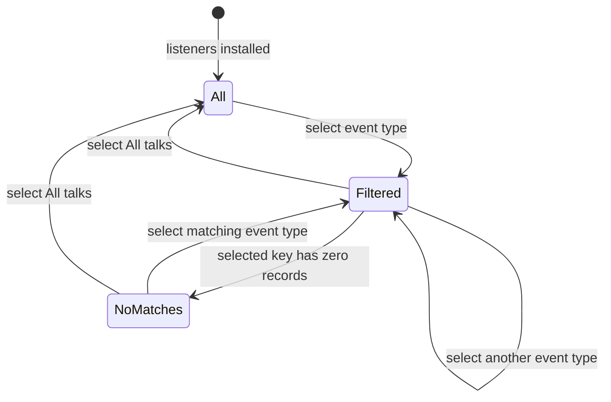

# Design Document: Talks Section

## Overview

The Talks section adds a static, author-managed archive at `/talks/` without creating a visitor upload path, an administration surface, a runtime content service, or a new analytics stream. Talk metadata lives in a dedicated Astro content collection, slide decks live as versioned public assets, and one validated read gateway supplies every human-readable and machine-readable output. This keeps publication behavior consistent with the repository's existing blog collection, static build, Markdown alternates, and privacy-first delivery model.

The frontend is an extension of the incumbent salih.dev visual system rather than a new visual identity. It retains the monochrome paper-and-ink palette, mono typography, fine rules, red accent, large page headings, and responsive archive patterns in `src/styles/global.css`. The Talks page uses a more presentation-specific composition: a concise page introduction, a compact event-type filter rail, and ruled talk entries in which the talk title and materials lead while event metadata remains easy to scan. The experience is primarily **Read**, with a restrained **Experience** quality because the talks and slide decks are the work being showcased.

### Goals

- Publish complete talk records and site-hosted PDF slides from repository-controlled content.
- Give visitors a fast chronological scan, exact event-type filtering, inline video playback when available, and resilient access to metadata and slides.
- Produce HTML, Markdown, sitemap, and LLM-oriented discovery outputs from the same validated talk snapshot.
- Preserve keyboard access, semantic structure, focus visibility, and layouts from 320 to 2560 CSS pixels.
- Reject invalid metadata, unsafe video URLs, missing or malformed PDFs, and inconsistent associations before any public output is generated.

### Non-goals

- Visitor-facing uploads, public administration, authentication, or alternate content editors.
- Runtime database or content API changes for talks.
- Arbitrary iframe providers, arbitrary embed HTML, autoplay before visitor intent, or third-party video requests before playback is requested.
- URL-, cookie-, local-storage-, or analytics-backed filter state.
- Per-talk detail pages; the canonical archive and its Markdown alternate are the public talk representations.

### Repository and research findings

- `src/content.config.ts` already uses Astro's file-backed `glob()` loader and a Zod schema. A second collection therefore extends an established build-time validation boundary rather than introducing a parallel content system. Astro documents content collections as typed, queryable sets and the loader API supports file-backed Markdown, JSON, YAML, and TOML sources ([Astro content collections](https://v5.docs.astro.build/ar/guides/content-collections/), [Astro loader API](https://v5.docs.astro.build/en/reference/content-loader-reference/)).
- `BaseLayout.astro`, `Header.astro`, and `global.css` centralize metadata, Markdown alternate links, navigation, focus treatment, responsive breakpoints, and visual tokens. The new surface should extend these shared contracts.
- `markdown-documents.ts`, paired `.md.ts` routes, `discovery.ts`, middleware, and CloudFront Functions implement Markdown negotiation. The edge mappings are explicit, so `/talks/` must be added to both application and production-edge mappings.
- `sitemap.xml.ts`, `llms.txt.ts`, and `llms-full.txt.ts` are the relevant discovery indexes. `verify-static-build.mjs` is the existing post-build invariant checker.
- Existing video markup already restricts blog directives to YouTube IDs and uses `youtube-nocookie.com`. YouTube describes this host as its privacy-enhanced embedding mode ([YouTube embed guidance](https://support.google.com/youtube/answer/171780?hl=en-GB)). Talks should tighten this further with click-to-load behavior.
- Zod supports typed object and array schemas plus structured validation errors, making it appropriate for field-level metadata diagnostics ([Zod schema API](https://zod.dev/api), [Zod error customization](https://v4.zod.dev/error-customization)). File bytes still require a separate build-time asset validator.

Content from external documentation is rephrased for compliance with licensing restrictions.

## Architecture

### System context

```mermaid
flowchart LR
  A[Author-managed talk source\nsrc/content/talks] --> C[Astro talks collection schema]
  B[Versioned PDF slides\npublic/talks/slides] --> D[Talk asset validator]
  C --> E[getValidatedTalks]
  D --> E
  E --> F[Published talk view models]
  F --> G[/talks/ HTML]
  F --> H[/talks/index.md]
  F --> I[sitemap.xml]
  F --> J[llms.txt and llms-full.txt]
  G --> K[Static dist output]
  H --> K
  I --> K
  J --> K
  K --> L[CloudFront clean routes and Markdown negotiation]
```

### Publication pipeline

1. The Author adds or updates one record under `src/content/talks/` and exactly one referenced PDF under `public/talks/slides/`.
2. Astro's collection schema validates and normalizes frontmatter without modifying the source file.
3. `getValidatedTalks()` performs collection-wide and file-level validation: real calendar dates, canonicalized unique tags, safe HTTPS URLs, supported video normalization, exactly one safe slide path, readable PDF bytes, successful PDF parsing, and a positive page count.
4. Any issue produces an aggregate author-facing build error grouped by record and field. No talk-derived route completes from an invalid snapshot.
5. The gateway excludes `draft: true` records, derives immutable `PublishedTalk` view models, and sorts them by date descending with a deterministic ID tie-breaker. The tie-breaker is an implementation convenience; requirements permit any same-day ordering.
6. The Talks page, Markdown serializer, and discovery routes consume the same gateway. They do not independently read raw records.
7. The static verifier checks the built representation pair, slide files, discovery membership, and absence of draft content.
8. Production CloudFront logic maps clean HTML paths and negotiates `/talks/index.md` before cache lookup, matching local development middleware behavior.

### Architectural decisions

| Decision                                               | Rationale                                                                                                                                                                                                               |
| ------------------------------------------------------ | ----------------------------------------------------------------------------------------------------------------------------------------------------------------------------------------------------------------------- |
| Dedicated file-backed `talks` collection               | Matches the existing author-controlled blog workflow and gives typed build-time records without a runtime service.                                                                                                      |
| Markdown records with frontmatter and no required body | Keeps content approachable to the Author while avoiding an unused description/body requirement. An optional body is out of scope so HTML and Markdown cannot drift through ungoverned prose.                            |
| Tracked PDFs under `public/talks/slides/`              | Astro copies public assets unchanged into `dist`; stable root-relative paths become `https://salih.dev/...` in production. Unlike generated blog images, slide decks remain reviewed source assets and are not ignored. |
| One validated read gateway                             | Prevents HTML, Markdown, filtering, and discovery from applying different publication or ordering rules.                                                                                                                |
| Progressive client filtering over complete static HTML | Initial content and machine access need no JavaScript. The enhancement only toggles already-rendered entries and retains all content if scripting fails.                                                                |
| Click-to-load, YouTube-only video                      | Reuses the repository's supported provider while preventing arbitrary iframe injection and avoiding a third-party request until visitor intent.                                                                         |
| No persisted filter state                              | The requirement only needs in-page filtering. Avoiding query parameters, storage, and telemetry is simpler and aligned with project privacy constraints.                                                                |
| Extend hard-coded edge representation maps             | Generic clean HTML rewriting already works, but Markdown negotiation and response links use explicit route maps in both app and infrastructure code.                                                                    |

### Output topology

| Output                                | Source                                            | Key invariant                                                              |
| ------------------------------------- | ------------------------------------------------- | -------------------------------------------------------------------------- |
| `/talks/index.html`                   | `src/pages/talks/index.astro`                     | Complete accessible archive of published talks.                            |
| `/talks/index.md`                     | `src/pages/talks/index.md.ts` + shared serializer | Same ordered published snapshot and public links as HTML.                  |
| `/sitemap.xml`                        | Existing route + talks canonical                  | Exactly one `https://salih.dev/talks/` entry.                              |
| `/llms.txt`                           | Existing concise index                            | One Talks core-page link and description.                                  |
| `/llms-full.txt`                      | Existing corpus route                             | Includes the Talks Markdown document once.                                 |
| CloudFront request/response functions | `infra/lib/edge-functions.ts`                     | Negotiates and advertises `/talks/index.md` for `/talks/`.                 |
| Built slides                          | `public/talks/slides/*.pdf`                       | Each published talk's single validated PDF exists in `dist/talks/slides/`. |

## Components and Interfaces

### Content and domain services

#### `talkSchema` in `src/content.config.ts`

Defines the metadata contract for every source record and reports field-level issues. String length is measured in Unicode code points after trimming, not JavaScript UTF-16 code units. Display strings are normalized to Unicode NFC. URL fields are parsed with `URL`; regex alone is not sufficient.

#### `getValidatedTalks(): Promise<readonly ValidatedTalk[]>`

The only raw collection read boundary. It returns every valid record, including drafts, after asynchronous PDF validation. It aggregates all metadata and asset issues before throwing `TalkValidationError`; it never writes or rewrites source data.

#### `getPublishedTalks(): Promise<readonly PublishedTalk[]>`

Filters validated records to `draft === false`, derives safe display/embed values, and returns a new immutable array sorted newest first. HTML, Markdown, sitemap metadata, and LLM indexes use this function or a single promise created from it during generation.

#### Pure domain helpers

```ts
type ValidationIssue = Readonly<{
  recordId: string;
  field: TalkField;
  criterion: string;
  message: string;
}>;

type TalkFilterOption = Readonly<{
  id: string;
  label: string;
  comparisonKey: string;
}>;

function validateTalkCandidate(
  candidate: unknown,
  recordId: string,
): ValidationIssue[];
function validateIsoDate(value: string): boolean;
function normalizeEventType(value: string): NormalizedEventType;
function normalizeVideoUrl(value: string): NormalizedVideo | null;
function resolveSlideAsset(slidePath: string): ResolvedSlideAsset;
function sortPublishedTalks(talks: readonly PublishedTalk[]): PublishedTalk[];
function deriveFilterOptions(
  talks: readonly PublishedTalk[],
): TalkFilterOption[];
function filterTalks(
  talks: readonly PublishedTalk[],
  selectedComparisonKey: string | null,
): PublishedTalk[];
function formatTalkDate(date: IsoDate): string;
function serializeTalksMarkdown(talks: readonly PublishedTalk[]): string;
```

`normalizeVideoUrl` returns `null` only when the optional field is absent; unsupported or malformed supplied values are validation failures. `resolveSlideAsset` accepts a validated root-relative path and returns both its repository file path and public URL. No helper accepts arbitrary HTML.

### Page and presentation components

#### `src/pages/talks/index.astro`

- Awaits the published talk snapshot once.
- Passes `title="Talks"` and an exact document-title override to `BaseLayout` so the `<title>` is exactly `Talks`, while social metadata may remain site-qualified.
- Renders one `h1` with the visible text `Talks`.
- Supplies the immutable talk array to the filter and archive components.
- Adds `CollectionPage` structured data with one `ItemList` entry per published talk; it does not duplicate visible page content or expose drafts.

#### `BaseLayout.astro` title interface extension

The existing `title` prop produces `Title | Salih Güler`, which does not satisfy the approved exact-title requirement. Add an optional `documentTitle` prop. The HTML `<title>` uses `documentTitle` when supplied; existing pages retain their current templated title. Open Graph and Twitter titles may continue to use the site-qualified title. This is a backward-compatible shared-layout extension rather than page-local head duplication.

#### `Header.astro` and navigation configuration

Add exactly one `{ label: "Talks", href: "/talks/" }` item to the central navigation list. The current-route predicate must compare normalized route boundaries so only the Talks item receives `aria-current="page"` on `/talks/`. Its existing accent rule is the non-color-only visual current-page indicator. The mobile navigation layout must derive its columns/wrapping from item count instead of retaining the current three-column assumption.

#### `TalkFilter.astro`

- Renders one `All talks` button followed by one button per distinct normalized event type.
- Uses native `button type="button"` controls in a group labeled `Filter talks by event type`.
- Exposes single selection through `aria-pressed`: exactly one button has `true` at all times.
- Shows selection with text/glyph and rule/border weight in addition to accent color.
- Is initially hidden and becomes visible only after its module script has installed listeners. If JavaScript fails, visitors see the complete archive rather than inert controls.
- Maps author labels to generated stable IDs (`event-type-0`, `event-type-1`, …). It never interpolates author text into a CSS selector or executable script.
- Does not update the URL, cookies, local storage, session storage, or analytics.

#### `TalkArchive.astro`

Renders either the empty archive message or the ordered list and an initially hidden no-match status. It owns a polite status region that reports the result count after a visitor changes filters. The no-match message inserts the selected display label as text, not HTML.

#### `TalkCard.astro`

Each record is one `article` with:

- one `h2` containing the talk title, with no second visible title occurrence;
- one linked conference/event name, using the exact source URL as its destination;
- one `<time datetime="YYYY-MM-DD">` formatted as full month, one- or two-digit day, and four-digit year;
- one location value;
- one list containing exactly the record's event-type labels;
- one slide link whose visible copy is `PDF slides` and whose accessible name includes both `PDF slides` and the talk title;
- zero or one `TalkVideo` component.

Metadata uses a semantic description list or equivalently grouped labeled text inside the article so values remain programmatically associated with their talk. Long titles, locations, labels, and URLs use wrapping-safe containers (`min-width: 0`, `overflow-wrap: anywhere`) rather than clipping or horizontal scrolling.

#### `TalkVideo.astro`

The component receives only a `NormalizedVideo`, never a raw embed URL.

Initial markup is a 16:9, site-styled placeholder with one native play button named `Play video for {talk title}` and a normal fallback link to the original supported HTTPS video URL. It includes no remote thumbnail and no iframe, so the provider receives no request before visitor action.

On Enter, Space, or pointer activation, a small module script replaces the placeholder control with exactly one iframe using the derived `https://www.youtube-nocookie.com/embed/{id}?autoplay=1` URL. The iframe remains inside the article, receives focus, and has `title="{talk title} video"`, `loading="lazy"`, `referrerpolicy="strict-origin-when-cross-origin"`, `allow="autoplay; encrypted-media; picture-in-picture; web-share"`, and `allowfullscreen`. Host, path, ID, and query construction are code-owned. Source records cannot add iframe attributes or query parameters.

The component never removes or covers the metadata, event link, slides link, or fallback video link. A provider/network/playback failure therefore cannot make the rest of the talk inaccessible. The fallback link opens through normal browser behavior and is not treated as the required inline playback path.

### Filtering controller

The page module follows this state transition:



For each transition, the controller:

1. sets `aria-pressed="true"` on exactly the selected button and `false` on all others;
2. toggles each talk article's `hidden` property based on its generated event-type IDs;
3. updates a visible result/no-match message and a polite status region;
4. leaves focus on the activated filter button;
5. makes no network or storage request.

Although options are derived from published records and therefore normally have matches, the no-match state remains implemented for defensive DOM/data changes and direct controller tests.

### Visual and responsive direction

The page inherits the existing restrained color strategy (`--paper`, `--ink`, `--muted`, `--accent`) and typography. It does not add card shadows, gradients, decorative thumbnails, rounded pill overload, or a competing display face.

- **First viewport:** the shared header is followed by the established oversized `Talks` heading and a concise statement about conference and community presentations. A ruled filter strip sits directly below, with `All talks` visibly selected. The newest talk title and date enter the viewport as the primary artifact.
- **Desktop:** each ruled talk entry uses an asymmetric grid: a narrow date/location/event-type rail and a wide title/materials area. Optional video occupies the wide column below the actions, never forcing metadata into a narrow track.
- **Tablet:** the rail becomes a compact wrapping metadata row above the title/actions; video remains full-width within the article.
- **Mobile (320px and above):** entries become one column, filter buttons wrap naturally, actions remain full labels, and 16:9 media uses `width: 100%` with no fixed minimum. No content uses viewport-width sizing that can exceed the padded site shell.
- **Wide screens (up to 2560px):** the existing `--max-width` limits line length and scanning distance. The archive does not stretch metadata across the full viewport.
- **Motion:** filter changes are immediate. Optional opacity transitions are permitted only when `prefers-reduced-motion` does not request reduction; visibility and state do not depend on animation.
- **Focus:** every link and button uses an enclosing outline at least 2 CSS pixels thick. The existing accent/paper pair must be confirmed at or above 3:1; if it fails measurement in any state, the focused control uses `--ink` or another measured token rather than relying on the accent.

## Data Models

### Author-facing record

One Markdown file represents one talk. The filename is its stable Astro collection ID and should be a human-readable slug.

```ts
type TalkFrontmatter = Readonly<{
  title: string;
  eventName: string;
  date: string;
  location: string;
  eventUrl: string;
  eventTypes: readonly string[];
  slides: string;
  videoUrl?: string;
  sourceCodeUrl?: string;
  draft: boolean;
}>;
```

Example shape (illustrative, not an additional required artifact):

```yaml
title: "Building agent-ready static websites"
eventName: "Example Conference"
date: "2026-06-18"
location: "Berlin, Germany"
eventUrl: "https://conference.example/talks/agent-ready-static-websites"
eventTypes:
  - "Conference"
slides: "/talks/slides/building-agent-ready-static-websites.pdf"
videoUrl: "https://www.youtube.com/watch?v=abcdefghijk"
draft: false
```

### Validation rules

| Field        | Validation and normalization                                                                                                                                                                                                                                                            |
| ------------ | --------------------------------------------------------------------------------------------------------------------------------------------------------------------------------------------------------------------------------------------------------------------------------------- |
| `title`      | Required scalar string; trim; NFC normalize; 1–200 Unicode code points.                                                                                                                                                                                                                 |
| `eventName`  | Required scalar string; trim; NFC normalize; 1–200 Unicode code points.                                                                                                                                                                                                                 |
| `date`       | Required scalar matching exactly `YYYY-MM-DD`; parse year/month/day in UTC and round-trip the components to reject impossible dates such as `2026-02-30`. No locale-dependent source parsing.                                                                                           |
| `location`   | Required scalar string; trim; NFC normalize; 1–200 Unicode code points.                                                                                                                                                                                                                 |
| `eventUrl`   | Required scalar, 1–2,048 Unicode code points after trim; absolute `https:` URL with a non-empty hostname and no credentials.                                                                                                                                                            |
| `eventTypes` | Required array of 1–10 scalar strings. Each value is trimmed, NFC normalized, and 1–50 Unicode code points. Uniqueness uses a canonical comparison key formed from normalized, locale-independent case-folded text, while display preserves the Author's trimmed capitalization.        |
| `slides`     | Required scalar and therefore exactly one association. Must be a root-relative path under `/talks/slides/`, contain no `..`, backslash, query, fragment, credentials, or encoded path separator, and end in `.pdf` case-insensitively. Arrays and additional slide fields are rejected. |
| `videoUrl`   | Optional scalar. When present, 1–2,048 Unicode code points, absolute `https:` URL, no credentials, exact supported host/path, and one valid provider ID. Empty strings are invalid rather than equivalent to omission.                                                                  |
| `draft`      | Boolean with default `false`. Draft records must still satisfy the full record and PDF contract; the flag controls publication, not validation quality.                                                                                                                                 |

Unknown frontmatter keys are rejected to catch misspellings and prevent unreviewed fields from silently appearing in one representation only. Runtime normalization creates a separate parsed value and never rewrites the source file.

### Validated domain model

```ts
type IsoDate = string & Readonly<{ __isoDate: true }>;
type SlidePath = string & Readonly<{ __slidePath: true }>;
type HttpsUrl = string & Readonly<{ __httpsUrl: true }>;

type NormalizedEventType = Readonly<{
  label: string;
  comparisonKey: string;
}>;

type NormalizedVideo = Readonly<{
  provider: "youtube";
  sourceUrl: HttpsUrl;
  videoId: string;
  embedUrl: HttpsUrl;
}>;

type ValidatedTalk = Readonly<{
  id: string;
  title: string;
  eventName: string;
  date: IsoDate;
  sortEpochMs: number;
  location: string;
  eventUrl: HttpsUrl;
  eventTypes: readonly NormalizedEventType[];
  slidePath: SlidePath;
  slideFilePath: string;
  slidePublicUrl: HttpsUrl;
  video: NormalizedVideo | null;
  draft: boolean;
}>;

type PublishedTalk = Omit<ValidatedTalk, "draft"> &
  Readonly<{
    draft: false;
  }>;
```

`slidePublicUrl` is derived with the configured site origin and is never authored independently. `embedUrl` is derived from the validated video ID and privacy-enhanced host; the source URL cannot override it.

### PDF asset validation

Metadata schema validation establishes association count and path safety. A dedicated asynchronous validator then:

1. resolves the path under the repository's `public/` directory and confirms the resolved path remains inside `public/talks/slides/`;
2. reads the file and rejects missing or zero-byte content;
3. checks the PDF signature as an early diagnostic, but does not treat signature presence as sufficient;
4. parses the complete document with a maintained PDF parser in strict/non-recovery mode;
5. rejects malformed/encrypted-unreadable documents and documents with fewer than one page;
6. returns file size and page count for verification diagnostics, not for public display.

The implementation must use a parser rather than handwritten page-marker counting because compressed/object-stream PDFs make textual counting unreliable. The parser runs only at build/test time and is added as an exact pinned development dependency.

After Astro copies public assets, `verify-static-build.mjs` confirms that each published slide path exists in `dist`, is non-empty, remains under `dist/talks/slides/`, and corresponds one-to-one with the published snapshot. Public links stay root-relative in HTML and become absolute `https://salih.dev/...` URLs in Markdown, guaranteeing the production domain requirement without environment-specific author input.

### Safe supported video model

The initial provider allowlist contains only YouTube because that is the sole provider already represented by repository code. Accepted source forms are narrowly defined:

- `https://www.youtube.com/watch?v={11-character-id}`
- `https://youtube.com/watch?v={11-character-id}`
- `https://youtu.be/{11-character-id}`

Hosts are compared after URL parsing, not by suffix matching; values such as `youtube.com.attacker.example` are rejected. Fragments, credentials, non-default ports, playlist-only URLs, alternate providers, arbitrary `/embed/` sources, and invalid IDs are rejected. Benign source query parameters are not copied to the iframe. The normalized iframe URL is always code-generated on `www.youtube-nocookie.com` with only the user-initiated autoplay parameter.

Supporting another provider later requires a new explicit parser/normalizer, privacy review, iframe policy, fallback behavior, and tests. Adding a hostname to an unchecked generic allowlist is insufficient.

### Shared derived projections

`PublishedTalk[]` is transformed into three projections without rereading source:

- **Archive projection:** sorted cards, generated event-type IDs, filter options, and empty state.
- **Markdown projection:** heading plus each talk's title, event link, ISO date, human-readable date, location, all event types, absolute PDF URL, and optional original video URL.
- **Discovery projection:** canonical Talks URL and newest talk date for sitemap `lastmod`; a concise Talks entry for `llms.txt`; the full Markdown projection for `llms-full.txt`.

The serializer escapes or formats Markdown-sensitive author text and emits URLs as link destinations without interpreting source as Markdown. This prevents titles or labels from changing document structure.

## Correctness Properties

**Definition:** _A correctness invariant is a characteristic or behavior that should hold true across all valid executions of a system—essentially, a formal statement about what the system should do. These invariants serve as the bridge between human-readable specifications and machine-verifiable correctness guarantees._

Correctness reflection consolidated criteria that exercise the same invariant: initial archive population is covered by publication projection; All-talks behavior is covered by filter identity; Markdown field and optional-video rules share one projection property; and slide association count and URL derivation share one safety property. Render-only, browser, filesystem, PDF-parser, and deployment criteria remain example or integration tests rather than being restated as weak properties.

### Property 1: Scalar metadata validation is exact

For any candidate title, event name, date, and location, scalar metadata validation accepts those fields if and only if each text value contains the permitted number of Unicode code points after trimming and the date is exactly a real `YYYY-MM-DD` calendar date; validation must reject every candidate that violates at least one of those predicates.

**Validates: Requirements 2.1, 2.2, 2.3, 2.4**

### Property 2: External URL and video normalization is safe

For any candidate conference URL or supplied video URL, validation accepts the conference URL if and only if it is a credential-free absolute HTTPS URL with a host and valid length, and accepts the video URL if and only if it also matches a supported YouTube source form; every accepted video URL normalizes to the same extracted 11-character ID on an HTTPS `www.youtube-nocookie.com` embed URL containing no author-controlled host, path, or extra query parameter.

**Validates: Requirements 2.5, 2.8**

### Property 3: Event-type validation enforces bounded canonical uniqueness

For any array of candidate event-type labels, validation accepts the array if and only if it has between one and ten entries, every trimmed label has between one and fifty Unicode code points, and every label has a distinct normalized comparison key; accepted display labels equal the trimmed, NFC-normalized author labels.

**Validates: Requirements 2.6**

### Property 4: Validation reports all metadata failures without mutation

For any candidate talk record containing any combination of metadata violations, validation rejects the record, returns an issue associated with each violated field and criterion, returns no issue for a satisfied metadata criterion, and leaves the candidate object and author source values unchanged.

**Validates: Requirements 2.9**

### Property 5: Publication projection is complete, unique, and chronological

For any finite collection of valid talk records, the published archive contains every and only record whose `draft` value is false exactly once, and every adjacent pair is ordered by date from latest to earliest.

**Validates: Requirements 3.1, 4.1**

### Property 6: Talk dates have the required human-readable form

For any valid ISO talk date, formatting produces the corresponding English full month name, calendar day without forced leading zero, and four-digit year without changing the represented calendar date.

**Validates: Requirements 3.5**

### Property 7: Talk tag projection is lossless

For any valid published talk, the event-type labels in its archive projection are exactly the labels assigned to that talk, each appears once, and no label from another talk or unassigned value appears.

**Validates: Requirements 3.6**

### Property 8: Filter options equal the distinct published tag union

For any finite published-talk collection, the event-type filter options contain exactly one option for every distinct normalized event-type key present in the collection and no other event-type option.

**Validates: Requirements 4.2**

### Property 9: Filtering returns the exact matching set and All is identity

For any finite published-talk collection and any event-type comparison key, filtering by that key returns every and only talk assigned that key exactly once, while filtering by All returns the original published sequence exactly once with no additions, removals, or reordering.

**Validates: Requirements 4.4, 4.5**

### Property 10: Filter selection remains one-hot

For any non-empty sequence of valid filter selections beginning at All talks, after every state transition exactly one filter option is selected and exposed as selected to assistive technologies, and that option is the most recently selected option.

**Validates: Requirements 4.9**

### Property 11: Slide association and public URL derivation are safe

For any candidate slide association, validation accepts if and only if it is exactly one safe root-relative PDF path beneath `/talks/slides/`; for every accepted path, public URL derivation preserves that path and produces an absolute URL whose protocol is exactly HTTPS and whose host is exactly `salih.dev`.

**Validates: Requirements 6.5, 6.7**

### Property 12: Markdown projection is complete and publication-safe

For any finite validated collection, the Talks Markdown projection contains one section for every and only published talk; each section contains that talk's title, event name and URL, date, location, every event type, and PDF URL, and contains the source video URL if and only if that same talk has a normalized video.

**Validates: Requirements 8.2, 8.3**

### Property 13: Human and machine projections preserve one snapshot

For any finite validated published-talk snapshot, deriving the archive and Markdown projections from that same value produces equivalent ordered talk identities and equivalent public metadata values, with no record or field taken from a different source version.

**Validates: Requirements 8.5**

## Error Handling

### Build-time validation failures

`TalkValidationError` contains an ordered list of `ValidationIssue` values. Diagnostics are deterministic: sort by record ID, then field, then criterion. A single build reports all discoverable issues instead of forcing the Author through one failure at a time.

Example diagnostic shape:

```text
Talk validation failed (2 issues)
- building-agent-ready-sites.videoUrl [Requirement 2.8]: unsupported video provider; expected an HTTPS YouTube watch or short URL
- building-agent-ready-sites.slides [Requirement 6.6]: PDF could not be parsed as a document with at least one page
```

Validation distinguishes these categories:

| Failure                                           | Handling                                                                                                             |
| ------------------------------------------------- | -------------------------------------------------------------------------------------------------------------------- |
| Missing, extra, wrong-type, out-of-range metadata | Reject generation with record ID, field, criterion, and concise expected condition.                                  |
| Multiple canonically equivalent event types       | Reject and identify both conflicting labels.                                                                         |
| Invalid or unsupported video URL                  | Reject; never fall back to embedding the raw URL.                                                                    |
| Unsafe slide path or wrong association count      | Reject before filesystem access and identify the association/path rule.                                              |
| Missing or zero-byte PDF                          | Reject with the source record and resolved author-facing path.                                                       |
| Malformed, unreadable, or zero-page PDF           | Reject with a `slides` issue; do not copy a talk-derived output as successful.                                       |
| Multiple invalid records                          | Aggregate issues across all records and fail once.                                                                   |
| Unexpected validator/parser exception             | Wrap with record and field context, retain the original cause for local logs, and show a non-secret concise message. |

Source files and PDFs are read-only during validation. The build does not trim, rewrite, repair, delete, or replace them. Because talk outputs are static generation products, a failed build does not update production; the existing deployment's last successful files remain in place.

### Visitor-facing resilience

| Condition                                             | Visitor behavior                                                                                                                                                                        |
| ----------------------------------------------------- | --------------------------------------------------------------------------------------------------------------------------------------------------------------------------------------- |
| No published talks                                    | HTML and Markdown remain successful, contain their page heading, and communicate that no talks are currently published. Filter controls are omitted because there is nothing to filter. |
| JavaScript unavailable or initialization fails        | The filter remains hidden and all published talks remain visible in static HTML. Links and metadata remain fully usable.                                                                |
| Selected filter produces zero matches                 | No talk article is shown; a visible, polite message names the selected event type using text-safe insertion. All filter buttons remain operable.                                        |
| Video script fails                                    | The click-to-load placeholder and normal fallback video link remain; metadata and PDF access are unaffected.                                                                            |
| Video provider/request/playback fails                 | The iframe occupies only its media region. Sibling title, metadata, conference link, PDF link, and fallback video link remain visible and keyboard-operable.                            |
| PDF request fails after a previously successful build | Normal browser error handling applies; no client script intercepts the link. Publication verification is responsible for preventing this in a new build.                                |
| Long or unexpected display content                    | Wrapping and single-column responsive fallbacks preserve controls and text; content is not truncated to conceal validation/design errors.                                               |

No visitor error path sends telemetry, stores identifiers, logs browser attributes from client code, or introduces a public write endpoint.

## Testing Strategy

The feature uses a dual approach: property tests cover the pure domain logic across broad generated inputs, while focused example, integration, static-build, browser, and infrastructure tests cover rendered structure, files, framework routing, and external boundaries. Property-based tests do not call AWS, YouTube, or the filesystem.

### Property-based tests

Use **fast-check** with the existing Node test style and a TypeScript-capable test execution path. Add test dependencies as exact pinned versions during implementation. Every property runs at least 100 generated cases; security-sensitive URL/path properties should run more when execution remains inexpensive.

Each correctness property is implemented by exactly one property-based test. Each test includes a comment in this format:

```ts
// Feature: talks-section, Property 9: Filtering returns the exact matching set and All is identity
```

Generators include:

- Unicode text with combining marks, astral characters, control whitespace, and values around every code-point limit;
- valid/invalid Gregorian dates including leap years and malformed zero-padded forms;
- parsed URL components with deceptive host suffixes, credentials, ports, fragments, encoded separators, and length boundaries;
- event-type arrays with normalization/case/whitespace collisions;
- talk collections with arbitrary IDs, dates, draft flags, and overlapping tags;
- Markdown-sensitive text such as brackets, parentheses, backslashes, headings, and line breaks;
- valid safe slide paths and traversal-like invalid paths;
- random filter-selection sequences.

When a generated failure is found, fast-check's shrunk counterexample is retained in test output and, if useful as a permanent regression, becomes one concise example test rather than a second property test for the same invariant.

### Example and edge-case tests

Focused tests cover behavior that does not benefit from randomization:

- exact `<title>Talks</title>`, one `h1`, one navigation link, and current-page state;
- one visible title, event name, location, tag occurrence, and slide action per representative card;
- with-video and without-video component branches;
- empty archive and defensive no-match messages;
- accessible names for slide, filter, play, and iframe controls;
- `All talks` as the initial filter state;
- Markdown escaping with one representative punctuation-heavy record.

Tests must not duplicate broad property coverage with many hand-picked scalar validation cases.

### PDF validation integration tests

Keep minimal reviewed fixtures for:

- one valid single-page PDF;
- one valid multi-page PDF;
- zero-byte content;
- non-PDF bytes with a `.pdf` name;
- signature-only or truncated malformed content;
- a parseable container with zero pages if the selected parser can represent one;
- an encrypted/unreadable PDF;
- missing file and unsafe-path references.

Assert acceptance only for valid documents with at least one page and assert record/field/criterion diagnostics for every rejection. Tests invoke the same `validatePdfAsset` implementation used by the build and never depend on a network service.

### Static-build and discovery verification

Extend `scripts/verify-static-build.mjs` to check:

- `dist/talks/index.html` and `dist/talks/index.md` both exist;
- built HTML has one canonical `/talks/` URL, one Markdown alternate, exact title, one `h1`, and no draft records;
- built Markdown contains the same ordered published talk IDs/metadata and conditional video links as HTML;
- every published slide exists under `dist/talks/slides/`, is non-empty, and is referenced once by the correct talk;
- `sitemap.xml`, `llms.txt`, and `llms-full.txt` each include the canonical Talks destination in the appropriate form exactly once and contain no non-canonical canonical declaration;
- an empty published collection still produces retrievable HTML and Markdown documents with no talk entries.

The verifier must not be weakened to accept missing machine-readable output or external slide hosts.

### Browser accessibility and responsive integration

Run populated, mixed-video, no-video, empty, and maximum-length fixtures in a real browser. Verify:

- Tab and Shift+Tab reach every filter, event link, PDF link, fallback video link, and video control in logical order;
- Enter activates links; Enter and Space activate buttons; play replacement remains on `/talks/` and moves focus to the iframe;
- exactly one `aria-pressed` state remains true after each interaction;
- blocking `youtube-nocookie.com` leaves all non-video content and actions operable;
- semantic headings, links, controls, labels, status messages, and associations pass automated accessibility inspection plus keyboard review;
- focus outlines are at least 2 CSS pixels and measured at least 3:1 against adjacent colors;
- at 320, 375, 720, 980, 1440, and 2560 CSS pixels, `document.documentElement.scrollWidth` does not exceed the viewport and no text/control overlap blocks content or activation;
- reduced-motion preference removes any optional transition without changing behavior.

External YouTube playback is stubbed or request-blocked in automated tests. One manual smoke check may confirm an actual supported public video, but the suite must not rely on provider availability.

### Edge and infrastructure tests

Extend `infra/test/edge-functions.test.ts` with `/talks/` cases for:

- HTML rewriting to `/talks/index.html`;
- Markdown preference rewriting to `/talks/index.md`;
- HTML preference retaining `/talks/index.html`;
- response `Link` headers advertising canonical HTML and Markdown alternate URLs.

Existing stack tests continue to verify privacy-preserving headers and logging fields. The feature adds no CloudFront logging field, browser telemetry, public endpoint, storage resource, or write permission.

### Validation commands

Implementation is complete only after the repository's existing gates pass:

```sh
npm test
npm run check
npm run build
npm run verify:build

cd infra
npm run build
npm test
npm run synth
```

The infrastructure commands are required because the design intentionally extends production CloudFront Function route mappings, even though it adds no AWS resource or deployment action.
